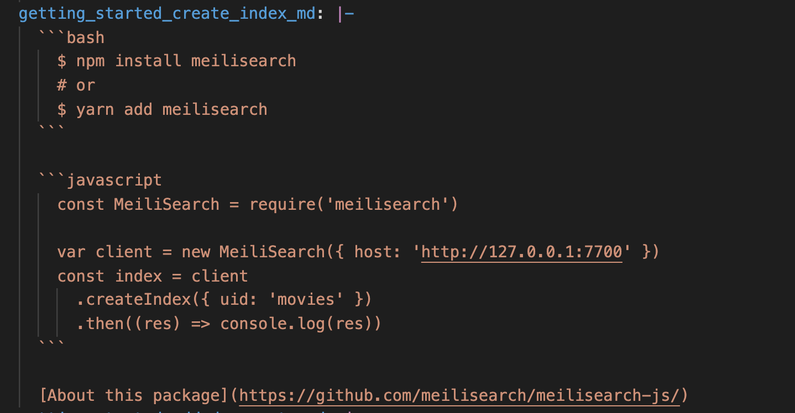

# CODE-SAMPLES

Code-sample is a MeiliSearch VuePress plugin that gathers sample files and adds them to the documentation.

Each official MeiliSearch SDK should provide a filled sample file in their respective language. The files are fetched by the documentation on each build (*see next chapter*).
Each sample of the file is added to the right place in the documentation, depending on its `sampleId`.

## Sample files

The sample file is a yaml file at the root of each MeiliSearch SDK.
Sample files are created based on the `sample-template.yaml` file.

`sample-template` file:
```yaml
get_one_index_1: |-
list_all_indexes_1: |-
create_an_index_1: |-
...
```

This file is accessible publicly [here](https://docs.meilisearch.com/sample-template.yaml) or in the public directory: `.vuepress/public/sample-template.yaml`.

Each official MeiliSearch SDK should have a sample file at its root with filled with samples in their respective language.
The name of the file should be `.code-samples.meilisearch.yaml`.

JavaScript example:
```yaml
get_one_index_1: |-
  client.getIndex('movies').show()
list_all_indexes_1: |-
  client.listIndexes()
create_an_index_1: |-
  client.createIndex({ uid: 'movies' })
  ...
```

The complete `cURL` sample is available at the root of the documentation repository.
Every other SDK sample should be available at the root of their respective repository.

## Samples

By the name of the `sampleId`, you should know where that code sample will be added to the documentation. Based on the `cURL` example or directly by going to the right place in the documentation, you should see what is expected from that sample.

Each sample is expected to be **written in the respective SDK language**.

There is **one exception** to this rule.
When the sampleId finishes with `_md`, it means it is expected to be written in markdown format.

### Example

JavaScript sample id:
```yaml
  get_one_index_1: |-
    client.getIndex('movies').show()
```
JavaScript sample id with _md extension:


## Add your sample files to the documentation

Access the following file
`.vuepress/code-samples/sdks.json`

And add your sample file to the list:
```json
[
  ...
  {
    "language": "sdk-language",
    "label": "sdk-label",
    "url": "url to yaml file"
  }
]
```

The `language` key expect a [supported language for the code highlight](https://meta.stackexchange.com/a/335336).

The `label` key is the name of the tab. While `label` and `language` could have been the same, it created some conflict (i.e: `bash` and `cURL`).

The `url` is the raw link to access your sample file. It should look like this:
`https://raw.githubusercontent.com/[PROJECT]/[REPO]/.code-samples.meilisearch.yaml`

### Development mode

When the documentation is running in development mode: `yarn dev`, the fetching is only done on the local sample file that contains the `cURL` examples.
