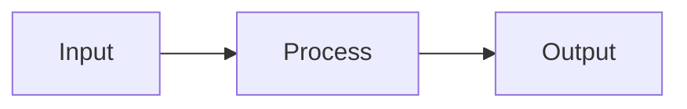
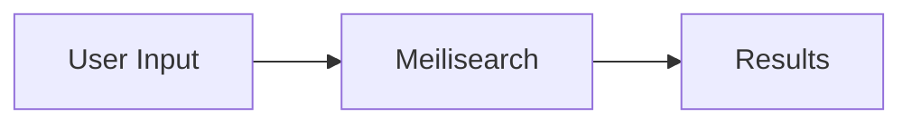
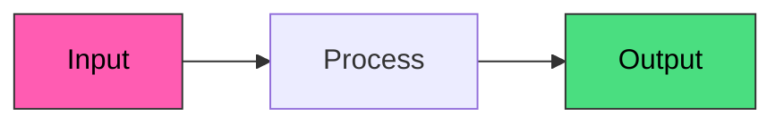

# Meilisearch Documentation Style Guide

This style guide ensures consistency across all documentation pages. Claude and human writers must follow these guidelines when creating or editing content.

**Reference Pages (Gold Standard):**
- `products/full_text_search/ranking_rules.mdx` - Excellent explanatory design
- `products/conversational_search/overview.mdx` - Exceptional narrative flow
- `guides/performance/pagination.mdx` - Model decision matrix structure
- `getting_started/sdks/rust.mdx` - Best SDK quick start

---

## Core Principles

### 1. User-Goal Oriented
Write from the user's perspective: "What do I want to achieve?" not "This feature exists."

**Good:** "Find restaurants within 2km of a location"
**Bad:** "The _geoRadius filter accepts latitude, longitude, and distance parameters"

### 2. Progressive Disclosure
Start simple, add complexity. Every page should serve both beginners and advanced users:
- Opening: What is this and why does it matter?
- Quick start: Get something working in 2-3 steps
- Deep dive: Configuration options, edge cases, advanced patterns

### 3. Cloud-First
Meilisearch Cloud is the primary experience. Examples should use environment variables, not localhost.

### 4. Actionable Content
Every page should help the user DO something, not just understand something.

---

## Voice and Tone

### Use Second Person
Address the reader directly as "you."

**Good:** "You can configure multiple embedders for different use cases."
**Bad:** "Users can configure multiple embedders..." or "One can configure..."

### Be Direct and Concise
Get to the point. Remove filler words.

**Good:** "Meilisearch returns results in under 50ms."
**Bad:** "It's worth noting that Meilisearch is designed to return results very quickly, typically in under 50 milliseconds."

### Use Active Voice
The subject performs the action.

**Good:** "Meilisearch indexes your documents automatically."
**Bad:** "Your documents are indexed automatically by Meilisearch."

### Avoid Marketing Language
State facts, not hype.

**Good:** "Meilisearch handles typos by default."
**Bad:** "Meilisearch's revolutionary typo tolerance feature delivers an amazing search experience!"

### Technical but Accessible
Explain concepts without being condescending. Assume the reader is a competent developer who may not know Meilisearch specifics.

### Entity References
- Use "Meilisearch" (not "we," "our," or "the system")
- Use "Meilisearch Cloud" for cloud-specific features
- Use "your application" or "your code" when referring to the user's implementation

---

## Page Structure

### Frontmatter (Required)

```yaml
---
title: Clear, descriptive page title
sidebarTitle: Short sidebar name    # Optional, for long titles
description: Concise summary for SEO (under 160 characters)
---
```

**Title conventions:**
- Overview pages: "[Product Name] overview"
- Getting started pages: "Getting started with [Product Name]"
- Feature pages: Use the feature name directly (e.g., "Ranking rules")

### Section Hierarchy

```markdown
# Page title (from frontmatter, don't repeat)

Opening paragraph (no heading)

## Main section
### Subsection
#### Sub-subsection (rarely needed)
```

**Rules:**
- Never skip heading levels (no ## followed by ####)
- Use sentence case for headings ("How it works" not "How It Works")
- Keep headings concise (under 6 words when possible)

---

## Product Overview Page Template

Every product overview must follow this structure:

```markdown
---
title: [Product Name] overview
sidebarTitle: Overview
description: [One sentence: what this enables and why it matters]
---

[1-2 sentence intro: what this is and the key benefit]

[If Cloud-only or experimental:]
<Note>
[Feature] is a Meilisearch Cloud feature.
</Note>

## Key features

<CardGroup cols={2}>
  <Card title="Feature name" icon="icon-name" href="/products/...">
    [Concrete benefit in one line. "X does Y" not just "X"]
  </Card>
  <!-- 3-4 cards total -->
</CardGroup>

## How it works



1. **Step name**: Brief explanation of what happens
2. **Step name**: Brief explanation
[...]

## Quick start

### 1. [Action verb] [thing]

[Brief context sentence if needed]

```bash
curl -X POST "${MEILISEARCH_URL}/indexes/example/endpoint" \
  -H "Authorization: Bearer ${MEILISEARCH_API_KEY}" \
  -H 'Content-Type: application/json' \
  --data-binary '{
    "key": "value"
  }'
```

### 2. [Next action]
[...]

## Use cases

<CardGroup cols={2}>
  <Card title="Use case name" icon="icon-name">
    [Concrete example: "X finds Y even when Z"]
  </Card>
  <!-- 3-4 use cases -->
</CardGroup>

## [Optional: Comparison or decision table]

| Aspect | Option A | Option B |
|--------|----------|----------|
| When to use | [scenario] | [scenario] |

## Next steps

<CardGroup cols={2}>
  <Card title="Get started" icon="rocket" href="/products/.../getting_started">
    Step-by-step setup guide
  </Card>
  <Card title="Related feature" icon="icon" href="/products/...">
    [Brief description]
  </Card>
  <!-- 2-4 cards -->
</CardGroup>
```

---

## Code Samples

### Environment Variables (Required)

Always use environment variables. Never use localhost or hardcoded values.

```bash
# Correct
curl -X POST "${MEILISEARCH_URL}/indexes/movies/search" \
  -H "Authorization: Bearer ${MEILISEARCH_API_KEY}" \
  -H 'Content-Type: application/json' \
  --data-binary '{"q": "search term"}'

# Incorrect
curl -X POST "http://localhost:7700/indexes/movies/search" \
  -H "Authorization: Bearer masterKey"
```

```javascript
// Correct
const client = new MeiliSearch({
  host: process.env.MEILISEARCH_URL,
  apiKey: process.env.MEILISEARCH_API_KEY
});

// Incorrect
const client = new MeiliSearch({
  host: 'http://localhost:7700',
  apiKey: 'masterKey'
});
```

### Language Tags
Always include language identifier in code blocks:

```bash
```bash
curl command
\```

```json
```json
{ "example": "data" }
\```

```javascript
```javascript
const code = 'example';
\```
```

### Code Block Conventions

1. **Keep examples minimal**: Show only what's needed to understand the concept
2. **Use realistic data**: "movies," "products," not "foo," "bar"
3. **Include comments only when necessary**: Code should be self-explanatory
4. **Show complete, working examples**: No `...` or placeholders in executable code

### Multi-Language Examples

Use `<Tabs>` for language variants:

```markdown
<Tabs>
  <Tab title="cURL">
```bash
curl command here
```
  </Tab>
  <Tab title="JavaScript">
```javascript
js code here
```
  </Tab>
</Tabs>
```

---

## Mintlify Components

### When to Use Each

| Component | Use For | Example |
|-----------|---------|---------|
| `<Note>` | Important information, setup requirements | "This feature requires Meilisearch v1.6+" |
| `<Tip>` | Helpful suggestions, best practices | "For better performance, configure X before Y" |
| `<Warning>` | Potential issues, breaking changes | "This will delete all documents" |
| `<Info>` | Additional context, nice-to-know | "This feature was introduced in v1.3" |
| `<CardGroup>` | Navigation, feature grids | "Key features", "Next steps" |
| `<Card>` | Single linked item with icon | Inside CardGroup |
| `<Tabs>` | Multiple options, language variants | Installation methods, SDK examples |
| `<Accordion>` | Optional/advanced content | FAQ, troubleshooting |
| `<CodeGroup>` | Related code examples | Request/response pairs |
| `<Steps>` | Numbered procedures | Installation guides |

### CardGroup Conventions

```markdown
<!-- 2 columns for 2-4 items -->
<CardGroup cols={2}>
  <Card title="Title" icon="icon-name" href="/path">
    Description (one line)
  </Card>
</CardGroup>

<!-- 3 columns for 5-6 items -->
<CardGroup cols={3}>
  ...
</CardGroup>
```

### Icon Selection

Use FontAwesome icons. Common icons:
- `rocket` - Getting started
- `gear` - Configuration/settings
- `code` - API reference
- `book` - Documentation/guides
- `bolt` - Performance
- `filter` - Filtering
- `magnifying-glass` - Search
- `brain` - AI/ML features
- `chart-line` - Analytics
- `key` - Security
- `users` - Teams/collaboration

---

## Cross-Linking

### Internal Links

Use relative paths without `.mdx` extension:

```markdown
<!-- Correct -->
[Learn more](/products/full_text_search/ranking_rules)

<!-- Incorrect -->
[Learn more](/products/full_text_search/ranking_rules.mdx)
[Learn more](https://meilisearch.com/docs/products/full_text_search/ranking_rules)
```

### Link Text Conventions

1. **Descriptive link text**: Not "click here" or "this page"
2. **Arrow suffix for "learn more" links**: `[Learn more about X →](/path)`
3. **Action-oriented for calls to action**: `[Get started](/path)` not `[Getting started page](/path)`

### Cross-Product Linking

Every product overview should link to at least 2 related products:

| Product | Should Link To |
|---------|---------------|
| Full-text search | AI-powered search, Faceted search |
| AI-powered search | Full-text search, Conversational search |
| Faceted search | Geo search, Full-text search |
| Geo search | Faceted search |
| Multi-search | All search products |
| Analytics | Personalization, Platform |
| Platform | Analytics, Indexing |
| Indexing | Full-text search, AI-powered search |

---

## Tables

### When to Use Tables

- Comparing options
- Listing features with descriptions
- API parameter reference
- Configuration options

### Table Formatting

```markdown
| Column 1 | Column 2 | Column 3 |
|----------|----------|----------|
| Value 1  | Value 2  | Value 3  |
```

**Conventions:**
- Use sentence case for headers
- Align text left (default)
- Keep cells concise
- Use inline code for technical values: `value`

---

## Mermaid Diagrams

### When to Use

- Explaining data flow
- Showing process steps
- Illustrating architecture

### Diagram Style

```markdown

```

**Conventions:**
- Use `graph LR` (left-to-right) for most flows
- Use `graph TD` (top-down) for hierarchies
- Keep diagrams simple (5-8 nodes max)
- Use clear, short labels
- Style important nodes with colors:



---

## Writing Checklist

Before submitting documentation:

### Content
- [ ] Does the opening explain what this is AND why it matters?
- [ ] Is there a working quick start example?
- [ ] Are code samples using environment variables?
- [ ] Do all links work?
- [ ] Is there a "Next steps" section?

### Structure
- [ ] Does frontmatter include title and description?
- [ ] Are headings in correct hierarchy?
- [ ] Is the page following the appropriate template?

### Tone
- [ ] Is it written in second person ("you")?
- [ ] Is it using active voice?
- [ ] Is it free of marketing language?
- [ ] Is "Meilisearch" used (not "we")?

### Technical
- [ ] Have all code examples been tested?
- [ ] Are all API endpoints and parameters accurate?
- [ ] Is the feature available in the stated version?

---

## Common Mistakes to Avoid

### 1. Starting with history or background
**Bad:** "Meilisearch has always focused on..."
**Good:** "AI-powered search uses embeddings to understand meaning."

### 2. Passive voice
**Bad:** "Results are returned by Meilisearch."
**Good:** "Meilisearch returns results."

### 3. Vague descriptions
**Bad:** "This feature helps with search."
**Good:** "Typo tolerance returns relevant results even when queries contain spelling mistakes."

### 4. Missing context for code
**Bad:** [Code block with no explanation]
**Good:** "Add documents to your index:" [Code block]

### 5. Inconsistent terminology
Pick one term and use it consistently:
- "Meilisearch" (not "meili" or "MS")
- "index" (not "collection")
- "document" (not "record" or "item")
- "attribute" (not "field" or "property" - though "field" is acceptable in some contexts)

---

## Updating This Guide

This style guide should evolve with the documentation. To propose changes:

1. Create a branch
2. Update this file
3. Submit PR with rationale
4. Get approval from documentation team

---

## Deep Dive Page Template

For pages that go deeper into a specific topic (not overview pages):

```markdown
---
title: [Specific Topic Name]
sidebarTitle: [Short name]
description: [One sentence explaining what this page covers]
---

[1-2 sentence intro connecting this to the broader product]

[If prerequisites exist:]
## Prerequisites

Before reading this page, you should understand:
- [Concept 1](/link)
- [Concept 2](/link)

## [Core Concept Explanation]

[Start with the "why" - explain what problem this solves]

[Then explain the "what" - how it works conceptually]

```mermaid
[Diagram if helpful]
```

## [Configuration/Usage]

[Show how to use this feature]

```bash
[Code example with environment variables]
```

## [Practical Examples]

[Show 2-3 real-world examples]

### Example 1: [Use Case Name]

[Explain the scenario]

```bash
[Working code]
```

[Explain the result]

### Example 2: [Different Use Case]

[...]

## Best Practices

[Provide guidance on optimal usage]

| Practice | Reason |
|----------|--------|
| Do X | Because Y |
| Avoid Z | Because W |

## Related Topics

- [Related page 1](/path) - [Brief description]
- [Related page 2](/path) - [Brief description]
```

---

## SDK Quick Start Template

For language-specific quick starts:

```markdown
---
title: [Language] SDK quick start
sidebarTitle: [Language]
description: Get started with Meilisearch using the [Language] SDK.
---

<Note>
This tutorial requires a running Meilisearch instance. [Get started with Meilisearch Cloud](https://cloud.meilisearch.com) or [self-host](/resources/self_hosting/getting_started).
</Note>

## Prerequisites

- [Language] [version]+ installed
- A Meilisearch URL and API key

## Installation

[Package manager tabs if applicable]

<Tabs>
  <Tab title="[Manager 1]">
```[language]
[install command]
```
  </Tab>
</Tabs>

## Connect to Meilisearch

```[language]
[Connection code with env vars]
```

## Add documents

```[language]
[Code to add sample documents]
```

## Search

```[language]
[Basic search code]
```

## Add a filter

```[language]
[Filtered search code]
```

## Full working example

```[language]
[Complete copy-paste-ready example]
```

## Next steps

<CardGroup cols={2}>
  <Card title="[Product Name]" icon="icon" href="/products/...">
    [Brief description]
  </Card>
  <Card title="SDK reference" icon="book" href="[SDK docs URL]">
    Full API documentation
  </Card>
</CardGroup>

## Resources

- [SDK GitHub repository]([URL])
- [[Language] SDK documentation]([URL])
```

---

## Guide Template

For how-to guides:

```markdown
---
title: [How to do X with Y]
sidebarTitle: [Short name]
description: [One sentence describing the outcome]
---

## Introduction

[1-2 sentences explaining what you'll learn and why it matters]

## Requirements

To follow this guide, you'll need:

- [Requirement 1]
- [Requirement 2]
- [Requirement 3]

## Step 1: [Action verb] [thing]

[Brief explanation of what this step accomplishes]

```[language]
[Code]
```

[Explanation of what the code does if not obvious]

## Step 2: [Next action]

[...]

## Step 3: [...]

[...]

## Test your implementation

[Show how to verify it works]

```[language]
[Test code]
```

**Expected output:**

```json
{
  "example": "output"
}
```

## Troubleshooting

### [Common issue 1]

[Solution]

### [Common issue 2]

[Solution]

## Conclusion

[Brief summary of what was accomplished]

## Next steps

- [Link to related guide](/path)
- [Link to reference docs](/path)
```

---

## Comparison Page Template

For pages comparing Meilisearch to alternatives:

```markdown
---
title: Meilisearch vs [Alternative]
sidebarTitle: [Alternative]
description: Compare Meilisearch and [Alternative] for your search needs.
---

## Quick comparison

| Aspect | Meilisearch | [Alternative] |
|--------|-------------|---------------|
| Hosting | Cloud + self-hosted | [Options] |
| Pricing | [Model] | [Model] |
| Search speed | [Metric] | [Metric] |
| Ease of setup | [Rating] | [Rating] |
| AI features | [Yes/No] | [Yes/No] |

## When to choose Meilisearch

[Bullet points of scenarios]

## When to consider [Alternative]

[Bullet points of scenarios - be fair and balanced]

## Feature comparison

### [Feature category 1]

[Detailed comparison]

### [Feature category 2]

[Detailed comparison]

## Migration

If you're coming from [Alternative]:

- [Key difference 1]
- [Key difference 2]
- [Migration resource link](/path)

## Resources

<CardGroup cols={2}>
  <Card title="Migration guide" icon="arrow-right" href="/path">
    Step-by-step migration
  </Card>
  <Card title="Get started" icon="rocket" href="/getting_started/overview">
    Try Meilisearch
  </Card>
</CardGroup>
```

---

## Quality Checklist by Page Type

### Overview Pages
- [ ] First paragraph explains what AND why
- [ ] Key features CardGroup (3-4 cards)
- [ ] "How it works" with mermaid diagram
- [ ] Working quick start (2-4 steps)
- [ ] Use cases section
- [ ] "Next steps" CardGroup

### Deep Dive Pages
- [ ] Connects to overview page
- [ ] Explains the "why" before the "what"
- [ ] Real-world examples (not just foo/bar)
- [ ] Best practices table
- [ ] Related topics links

### SDK Quick Starts
- [ ] Installation with package manager tabs
- [ ] Connection using env vars
- [ ] Add documents example
- [ ] Basic search example
- [ ] Filtered search example
- [ ] Full working example (copy-paste ready)
- [ ] Proper error handling (not suppressed)
- [ ] Next steps CardGroup

### Guides
- [ ] Clear requirements section
- [ ] Step-by-step with numbered headings
- [ ] Working code at each step
- [ ] "Test your implementation" section
- [ ] Troubleshooting section
- [ ] Expected output shown

---

## Anti-Patterns to Avoid

Based on analysis of weak pages:

### 1. Feature Checklist Without Context
**Bad (Platform overview style):**
> "Teams & collaboration: Invite team members, manage roles"

**Good:**
> "Teams & collaboration: Share search projects with your team. Assign roles to control who can modify settings versus who can only search."

### 2. Technical Details Without Business Value
**Bad:**
> "Analytics tracks searches, clicks, and conversions."

**Good:**
> "Analytics helps you understand what users search for and whether they find it. Use zero-result rate to identify content gaps. Use click-through rate to measure relevancy."

### 3. Shallow Quick Starts
**Bad:**
> "1. Configure the setting. 2. Make a search request."

**Good:**
> "1. Configure filterable attributes [with explanation]
> 2. Add sample documents [with example]
> 3. Search with a filter [with working code]
> 4. Verify the results [with expected output]"

### 4. Missing "When to Use" Guidance
**Bad:**
> "Multi-search sends multiple queries in one request."

**Good:**
> "Multi-search sends multiple queries in one request. Use it when:
> - You need to populate multiple UI sections from one API call
> - You want to reduce latency by batching related queries
> - You're building autocomplete with suggestions from multiple indexes"

### 5. Duplicated Content Without Clear Navigation
**Bad:** Same concept explained in 3+ places with different depths

**Good:** One canonical page with clear cross-references:
> "For a quick overview, see [Overview](/path). For configuration details, see [Configuration](/path). For troubleshooting, see [Troubleshooting](/path)."

---

*Last updated: January 2026*
