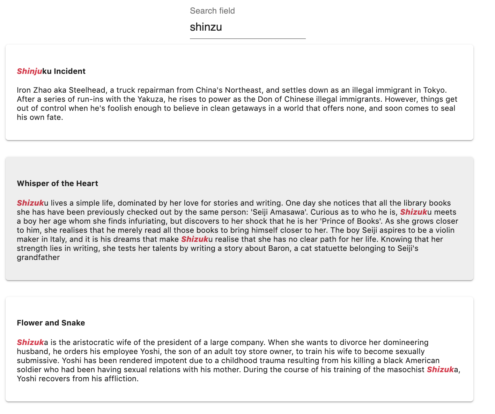

# Ranking

<!-- - Criterion 
- Ranking rules
- sorting rules -->

In meilisearch, the search responses are considered relevant according to a sorted list of rules called **ranking rules**. When a search query is made, it will be compared in different ways with all the documents stored in meilisearch. This comparison will start with the first ranking rule and continue with the next one until the desired number of matching documents has been found. This is called the [bucket sort](/advanced_guides/bucket_sort).

MeiliSearch proposes default ranking rules and has given them a default order as well. **This order can be modified, rules can be deleted and new ones can be added.**


<mermaid>
graph LR
    A[client] -->|Search Query| B(meilisearch)
    B --> C{bucket sort}
    C -->|One| D[Number of Typos]
    C -->|Two| E[Number of Words]
    C -->|Three| F[Words Proximity]
    C -->|Four| G[Attribute]
    C -->|Five| H[Position]
    C -->|Six| I[Exact]
    C --> B
    B --> |found documents| A
</mermaid>

[For some in depth explanations about the mechanism and about each default sorting rule](https://github.com/meilisearch/MeiliSearch/issues/358).

In order to be able to play with these rules and match them to the needs of your search engine, it is important to understand how each works and how to create new ones.

## MeiliSearch ranking rules

Some rules already exist in MeiliSearch. These rules are essential to the relevance of the search engine.

Each of the rules has a role in finding the right documents for the given search query. The order in which they are declared affects the importance of each rule. So the first rule is the most important, then the second and so on. By default, Meilisearch has these rules in a specific order, thinking it meets the most standard needs. This order can be changed to fit your needs.

Using a [bucket sort](/advanced_guides/bucket_sort) algorithm, MeiliSearch uses rule by rule to find documents, filling them in buckets until the desired amount of documents is obtained.

Here is the list of all the rules that are executed in this specific order by default:

- `typo` - The less typos there are beween the query words and the document words, the better is the document.
- `words` - A document containing more of the query words will be more important than one that contains less.
- `proximity` - The closer the query words are in the document the better is the document.
- `attribute` - A document containing the query words in a more important attribute than another document is considered better.
- `words position` - A document containing the query words at the start of an attribute is considered better than a document that contains them at the end.
- `Exact` - A document containing the query words in their exact form, not only a prefix of them, is considered better.


## Example


Lets analyze this example. 

**Rule one** : `typo`
- `Shinjuku` 
- `Shizuku`
- `Shizuka`

All three examples are at a levenhstein distance of 3 with `shinzu`. So by our first rule `typo` all 3 documents have the same relevance.

**Rule two** : `words`

Our query is `shinzu`. All three documents contains a matching word. This means they all have the same relevance. If we had made a search request with multiple words and some documents only have one of the two words, those would be less relevant than the documents containing both.


**Rule three** : `proximity`

Proximity is used when more than one word is given in the search query. In this case, how closer the words that compose the query are near eachother how more relevant the document become ([look at this example](./assets/img/proximity_example.8c58dbb3.png)). In our case, our search query

**Rule four** : `attribute`
- `Shinjuku` is in the `title`.
- `Shizuku` is in the `overview`.
- `Shizuka` is in the `overview`.

When adding the first documents in the index. Inside each document the `title` attribute was declaredd before the `overview` attribute. Because of that, MeiliSearch infered that the `title` attribute was more relevant than the `overview` attribute.

In this case, `Shinjuku` is in a more relevant attribute than the two others, that's why he is before them in the search results.

**Rule five** : `words position`

All three documents have the matches word at the start of their attrbute. This means they are considered at the same relevancy. All documents with matching words placed farther away in the attributes are considered less relevant.

**Rule six** : `Exact`


<!-- is before `Shinzoku lives a simple life`  -->


## Changing the rules order

Depending on your needs, you might want to change the order in which the rules are processed.

For example, you could consider 

## Creating your rule

## Adding your rule


<!-- What happens when there is no ranking order :
  - Key => value dans la database 
  - Du coup au pif les docum qui se trouvent la

 -->


## Custom ranking rules

Custom ranking rules gives you the possibility to add new rules. New rules can be added on attributes that has the `ranked` tag in the [schema](/main_concepts/indexes.md#ranked).

A rule is defined by an **attribute** and a **ascendent** `asc` or **descendent** `dsc` property.

The name of the ranking rule is the name of the attribute on which the rule is made.

For those rules to be applied by MeiliSearch on your search queries, it must be added to the [ranking order](/advanced_guides/ranking.md#ranking-order).

::: warning
If the rule is not added to the rule ranking order, it will be **ignored** by MeiliSearch.
:::

### Example

On the `release_date` attribute of a movie data set, which contains the timestamp of the release date.
```bash
 curl --request POST 'http://localhost:7700/indexes/movies/settings'
  --data '{ "rankingRules": { "release_date": "dsc" } }'
```

We create a custom ranking rule that must have the attribute name as key: `release_date` and we ask it to be `dsc` which means *descending*.

Now if added to the ranking order documents will be ordered by descending release_date.

## Ranking order

The ranking order determine the order of each rule in the [bucket sort](/advanced_guides/bucket_sort).

The default ranking order is as follows ([*see above for more detail about each rule*](/advanced_guides/ranking.md#ranking-rules)):

- `Number of Typos`
- `Number of Words`
- `Words Proximity`
- `Attribute`
- `Position`
- `Exact`

[The ranking order can be changed](/references/settings.md#ranking-rules). Rules can be removed by omitting them in the ranking order list, and custom rules must be added in the ranking order list to be applied.

Each time you create **a new ranking rule it must be added to the existing ranking order to be applied** by the [bucket sort](/advanced_guides/bucket_sort.md).

### Example

To apply the [custom ranking rule added previously](/advanced_guides/ranking.md#custom-ranking-rules), lets add it to the ranking order.

```bash
curl --request POST 'http://localhost:7700/indexes/movies/settings' \
  --data '{
  "rankingOrder": [
    "_sum_of_typos",
    "_number_of_words",
    "_word_proximity",
    "_sum_of_words_attribute",
    "_sum_of_words_position",
    "_exact",
    "release_date"
  ]
}'
```

Now, our **search results will be ordered by descending date** after all other rules have been applied in the [bucket sort](/advanced_guides/bucket_sort).
