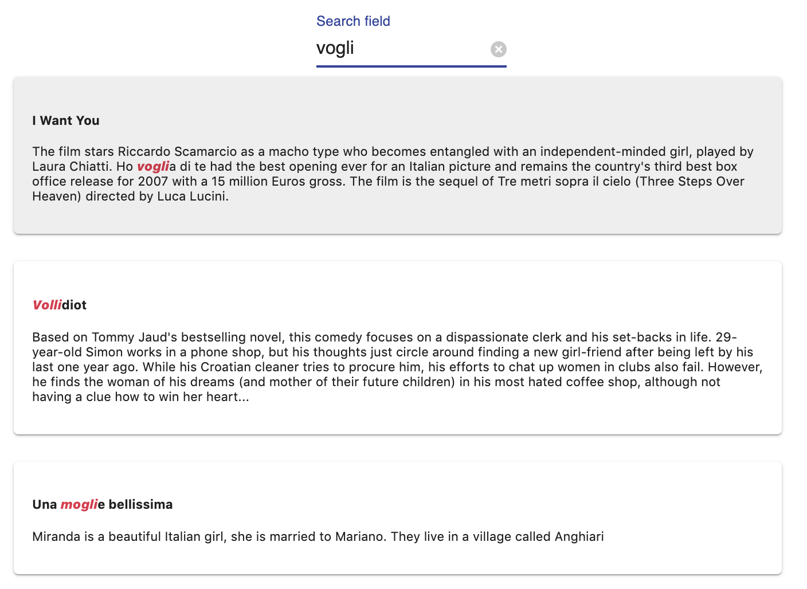
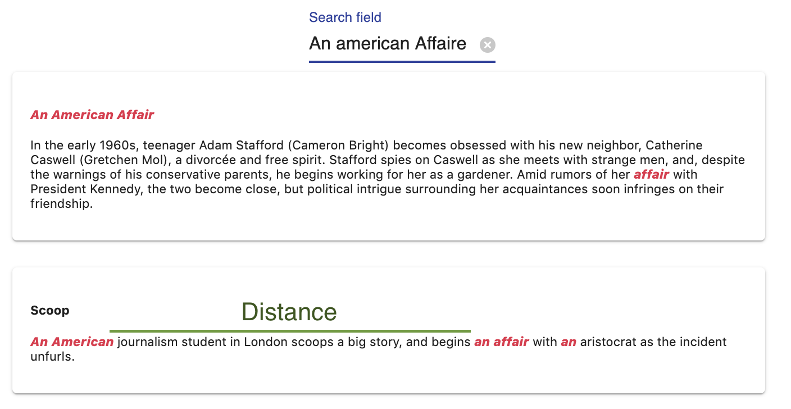
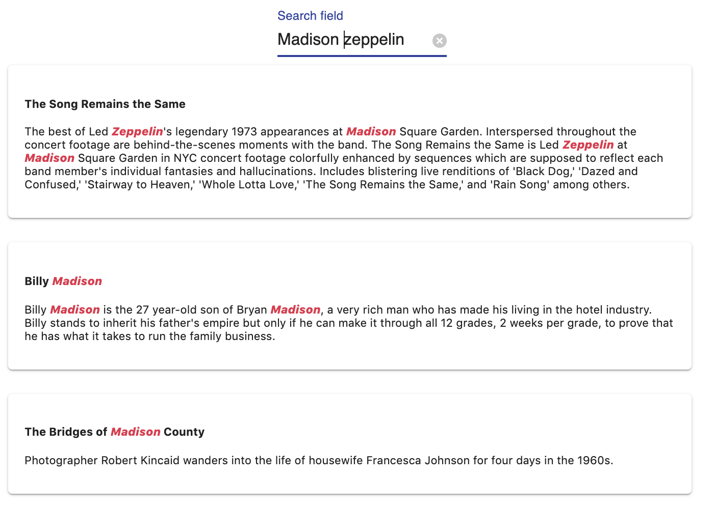

# Ranking

<!-- - Criterion
- Ranking rules
- sorting rules -->

In meilisearch, the search responses are considered relevant according to a sorted list of rules called **ranking rules**. When a search query is made, it will be compared in different ways with all the documents stored in meilisearch. This comparison will start with the first ranking rule and continue with the next one until the desired number of matching documents has been found. This is called the [bucket sort](/advanced_guides/bucket_sort).

MeiliSearch proposes default ranking rules and has given them a default order as well. **This order can be modified, rules can be deleted and new ones can be added.**


[For some in depth explanations about the mechanism and about each default sorting rule](https://github.com/meilisearch/MeiliSearch/issues/358).

In order to be able to play with these rules and match them to the needs of your search engine, it is important to understand how each works and how to create new ones.

## Ranking rules

Some rules already exist in MeiliSearch. These rules are essential to the relevance of the search engine.

Each of the rules has a role in finding the right documents for the given search query. The order in which they are declared affects the importance of each rule. So the first rule is the most important, then the second and so on. By default, Meilisearch has these rules in a specific order, thinking it meets the most standard needs. This order can be changed to fit your needs.

Using a [bucket sort](/advanced_guides/bucket_sort) algorithm, MeiliSearch uses rule by rule to find documents, filling them in buckets until the desired amount of documents is obtained.

Here is the list of all the rules that are executed in this specific order by default:

- `typo` - Sort by increasing number of typos.
- `words` - Sort by decreasing number of matched query words.
- `proximity` -  Sort by increasing proximity of query words in hits.
- `attribute` - Sort according to the order of attributes (defined by the [schema](/main_concepts/indexes.md#schema-definition)).
- `words position` - Sort according to the position of query words in the attribute. Start is better than end.
- `Exact` - Sort by similarity of the matched words with the query words. Same words are better than prefixes.


## Examples

:::: tabs

::: tab typo


search query : `vogli`

**Rule one** : `typo`

Matched words :
- `vogli` : 0 typo
- `volli` : 1 typo
- `mogli` : 1 typo

The typo sorts the results by ascending typos on matched query words.

**Rule two** : `words`

All three documents have the same number of matched query words. Thus, **no impact** on the relevancy.

**Rule three** : `proximity`

Since our search query is only one word, the results are **not impacted** by the `proximity rule`.

**Rule four** : `attribute`
- `vogli` : overview
- `volli` : title
- `mogli` : overview

In our [schema](/main_concepts/indexes.md#ranked) definition, we defined the `title` before the `overview`. This make any results found in title more relevant than one found in `overview`. Because `typo` is a more important rule than `attribute`, `vogli` is still first but `volli` is sorted higher than `mogli`.

Since previous rules defined the sorting of our three documents none of the following rules will affect their position : `words position`, `Exact`
:::


::: tab proximity

:::


::: tab words


search query : `Madison zeppelin`

**Rule one** : `typo`
All documents found have no typos. Order not impacted

**Rule Two** : `words`
- `The song remains the same` : **4** occurences of our query words.
- `Billy Madison` : **3** occurences of our query words.
- `The bridges of Madison County` : **1** occurence of our query words.

All other rules being less important than `words`, they will not impact the ordering.
:::

::::

## Changing the rules order

Depending on your needs, you might want to change the order in which the rules are processed.

For example, in your datasat, the `words` rule that sorts by number of matched query words in a document, could be less important than the `attribute` rule in which we find our matches.

In this case, using the [settings route](/references/settings.md#add-or-replace-index-settings) of your index, you can change the ranking order of the sorting rules.

```json
{
  "rankingOrder": [
       "_typo",
        "_attribute",
        "_proximity",
        "_words",
        "_words_position",
        "_exact",
  ]
}
```

## Creating your rule


## Adding your rule


<!-- What happens when there is no ranking order :
  - Key => value dans la database
  - Du coup au pif les docum qui se trouvent la

 -->


## Custom ranking rules

Custom ranking rules gives you the possibility to add new rules. New rules can be added on attributes that has the `ranked` tag in the [schema](/main_concepts/indexes.md#ranked).

A rule is defined by an **attribute** and a **ascendent** `asc` or **descendent** `dsc` property.

The name of the ranking rule is the name of the attribute on which the rule is made.

For those rules to be applied by MeiliSearch on your search queries, it must be added to the [ranking order](/advanced_guides/ranking.md#ranking-order).

::: warning
If the rule is not added to the rule ranking order, it will be **ignored** by MeiliSearch.
:::

### Example

On the `release_date` attribute of a movie data set, which contains the timestamp of the release date.
```bash
 curl --request POST 'http://localhost:7700/indexes/movies/settings'
  --data '{ "rankingRules": { "release_date": "dsc" } }'
```

We create a custom ranking rule that must have the attribute name as key: `release_date` and we ask it to be `dsc` which means *descending*.

Now if added to the ranking order documents will be ordered by descending release_date.

## Ranking order

The ranking order determine the order of each rule in the [bucket sort](/advanced_guides/bucket_sort).

The default ranking order is as follows ([*see above for more detail about each rule*](/advanced_guides/ranking.md#ranking-rules)):

- `Number of Typos`
- `Number of Words`
- `Words Proximity`
- `Attribute`
- `Position`
- `Exact`

[The ranking order can be changed](/references/settings.md#ranking-rules). Rules can be removed by omitting them in the ranking order list, and custom rules must be added in the ranking order list to be applied.

Each time you create **a new ranking rule it must be added to the existing ranking order to be applied** by the [bucket sort](/advanced_guides/bucket_sort.md).

### Example

To apply the [custom ranking rule added previously](/advanced_guides/ranking.md#custom-ranking-rules), lets add it to the ranking order.

```bash
curl --request POST 'http://localhost:7700/indexes/movies/settings' \
  --data '{
  "rankingOrder": [
    "_sum_of_typos",
    "_number_of_words",
    "_word_proximity",
    "_sum_of_words_attribute",
    "_sum_of_words_position",
    "_exact",
    "release_date"
  ]
}'
```

Now, our **search results will be ordered by descending date** after all other rules have been applied in the [bucket sort](/advanced_guides/bucket_sort).
