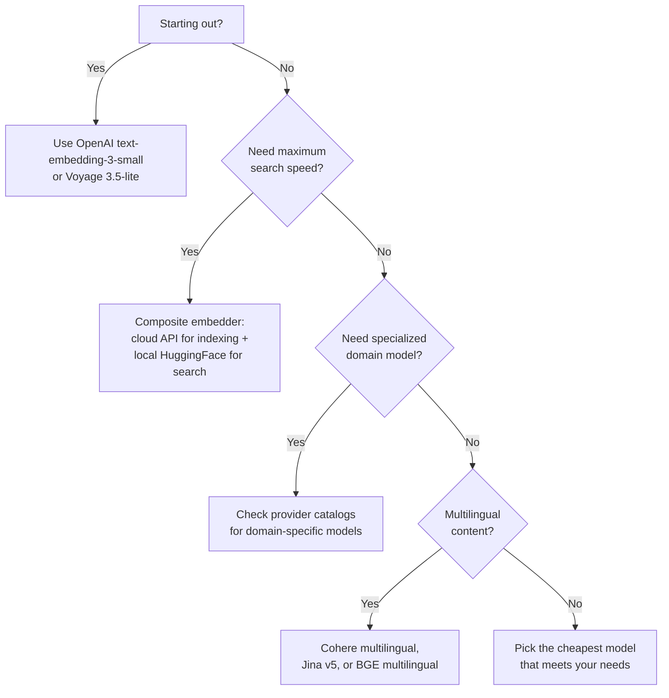

Choosing an embedding model is not just about quality. Cost, indexing speed, search latency, dimensions, and domain specialization all matter. In most cases, a smaller, cheaper model will serve you better than the largest available option.

## Available providers

Meilisearch supports a wide range of embedding providers, each with different models, pricing, and strengths:

| Provider | Models | Strengths | Guide |
|----------|--------|-----------|-------|
| OpenAI | text-embedding-3-small, text-embedding-3-large | Straightforward setup, good general quality | [Guide](/capabilities/hybrid_search/how_to/configure_openai_embedder) |
| Cohere | embed-v4.0, embed-english-v3.0, embed-multilingual-v3.0 | Strong multilingual support, input type optimization | [Guide](/guides/embedders/cohere) |
| Voyage AI | voyage-3.5-lite, voyage-3.5, voyage-3-large | High quality, competitive pricing | [Guide](/guides/embedders/voyage) |
| Jina | jina-embeddings-v5-text-small/nano, jina-embeddings-v3 | Multilingual, affordable, fast | [Guide](/guides/embedders/jina) |
| Mistral | mistral-embed | Good for existing Mistral users | [Guide](/guides/embedders/mistral) |
| Google Gemini | gemini-embedding-001 | High dimensions (3072), Google ecosystem | [Guide](/guides/embedders/gemini) |
| Cloudflare | bge-small/base/large, embeddinggemma, qwen3 | Edge network, low latency, free tier | [Guide](/guides/embedders/cloudflare) |
| AWS Bedrock | Titan v2, Nova, Cohere on Bedrock | AWS ecosystem, multimodal options | [Guide](/guides/embedders/bedrock) |
| HuggingFace (local) | Any compatible model | No API costs, full control | [Guide](/capabilities/hybrid_search/how_to/configure_huggingface_embedder) |
| HuggingFace Inference | Any hosted model | Scalable open-source models | [Guide](/guides/embedders/huggingface) |

## Smaller models are often better

Bigger is not always better. In a hybrid search setup, Meilisearch combines keyword results with semantic results using its [smart scoring system](/capabilities/hybrid_search/overview#smart-result-ranking). Full-text search already handles exact matches very well, so the semantic side only needs to capture general meaning, not every nuance.

This means a small, fast embedding model is often enough. The quality difference between a 384-dimension model and a 3072-dimension model is rarely worth the extra cost and latency, especially when the keyword side is already covering precise queries.

**Prioritize cheaper, faster models** unless you have a specific reason to need more dimensions or higher embedding quality. Models like `text-embedding-3-small`, `voyage-3.5-lite`, `jina-embeddings-v5-text-nano`, or `embed-english-light-v3.0` are excellent starting points.

## What to look for

### Cost and rate limits

Embedding providers charge per token or per request. For large datasets, embedding costs add up during indexing. Consider:

- **Free tiers**: Cloudflare Workers AI and local HuggingFace models have no per-request cost
- **Rate limits**: free-tier accounts on paid providers may slow down indexing significantly. Meilisearch handles retries automatically, but higher tiers index faster
- **Re-indexing**: Meilisearch caches embeddings and only re-generates them when document content changes, reducing ongoing costs

### Dimensions

Lower-dimension models are faster to index, use less memory, and produce faster searches. Higher dimensions can capture more semantic nuance but with diminishing returns.

| Dimensions | Trade-off |
|-----------|-----------|
| 384 | Fast, low memory, good for most use cases |
| 768-1024 | Balanced quality and performance |
| 1536-3072 | Higher quality, slower, more memory |

### Domain specialization

Some providers offer models specialized for specific domains:

- **Legal, medical, financial**: check if your provider has domain-specific models or fine-tuned variants
- **Multilingual**: if your content is not in English, choose a model with explicit multilingual support (Cohere's multilingual models, Jina v3/v5, or multilingual BGE models)
- **Code**: some models are optimized for code search

### Indexing speed

Embedding generation is the main bottleneck during indexing. Two factors affect speed:

- **API latency**: cloud providers add network round-trip time per batch. Providers with edge networks (Cloudflare) or regional endpoints (Bedrock) can be faster
- **Model size**: larger models take longer to compute embeddings, even on the provider side

## Maximize performance with composite embedders

If you need the best possible indexing speed and search latency, consider using a [composite embedder](/capabilities/hybrid_search/advanced/composite_embedders). This lets you use different models for indexing and search:

- **Indexing**: use a cloud provider (Cloudflare Workers AI, HuggingFace Inference Endpoints, or any REST API) to generate high-quality embeddings at scale without impacting your Meilisearch server
- **Search**: use a local HuggingFace model (like `BAAI/bge-small-en-v1.5`) running inside Meilisearch for near-instant query embedding with zero API latency

This combination gives you the throughput of a cloud API for indexing with the speed of a local model for search. Both models must produce embeddings with the same number of dimensions.

## User-provided embeddings

If you work with non-textual content (images, audio) or already generate embeddings in your pipeline, you can supply pre-computed vectors directly. See [search with user-provided embeddings](/capabilities/hybrid_search/how_to/search_with_user_provided_embeddings).

## Decision flowchart

<CodeGroup>

</CodeGroup>
