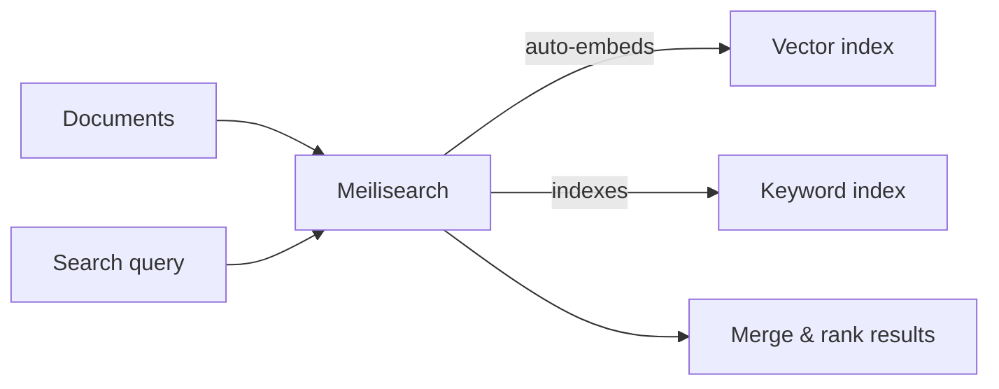

Hybrid search combines two search strategies: [full-text search](/capabilities/full_text_search/overview) (matching keywords) and semantic search (matching meaning). This gives users the best of both worlds, returning results that are both textually and conceptually relevant.

## Embedding models, not LLMs

Semantic search in Meilisearch relies on **embedding models**, not large language models (LLMs). This is an important distinction:

- **Embedding models** convert text into numerical vectors that capture meaning. They are small, fast, and inexpensive to run.
- **LLMs** (like GPT-4 or Claude) generate text and reason about it. They are much larger, slower, and more expensive.

Meilisearch uses embedding models for hybrid and semantic search, making it orders of magnitude cheaper and faster than LLM-based approaches. For conversational AI features that do use LLMs, see [conversational search](/capabilities/conversational_search/overview).

## How it works

When you configure an embedder, Meilisearch automatically generates vector embeddings for every document in your index. You don't need to compute or manage embeddings yourself.

At search time, Meilisearch runs both keyword and semantic search in parallel, then merges the results using a smart scoring system.

### Automatic embedding generation

Meilisearch handles the entire embedding pipeline for you:

- **Batching**: documents are grouped and sent to the embedding provider in optimized batches, minimizing API calls and maximizing throughput
- **Caching**: embeddings are stored and only regenerated when document content changes, so re-indexing unchanged documents costs nothing. Note that changing your embedder configuration (switching model, provider, or document template) triggers a full re-embedding of all documents, which may incur significant API costs for large indexes
- **Rate limit handling**: Meilisearch automatically retries when providers return rate limit errors, with no configuration needed
- **Document templates**: you control exactly which fields are embedded using [Liquid templates](/capabilities/hybrid_search/advanced/document_template_best_practices), so the embedding captures the most relevant parts of each document

<Warning>
Updating embedder settings may trigger a full reindex. When you partially update an index's embedder settings (for example, changing `model`, `source`, `documentTemplate`, `dimensions`, or `pooling`), Meilisearch may reindex all documents and regenerate their embeddings. For large indexes this can take a long time and, with paid providers, incur significant API costs.

[`distribution`](/capabilities/hybrid_search/advanced/tune_distribution) is a notable exception: changing it does not trigger a reindex.
</Warning>

### Smart result ranking

When you perform a hybrid search, Meilisearch does not simply concatenate keyword and semantic results. It uses a scoring system that automatically determines, for each query, whether full-text or semantic results are more relevant:

- A precise query like `"iPhone 15 Pro Max 256GB"` will naturally favor keyword matches, because the exact terms appear in matching documents
- A descriptive query like `"lightweight laptop for travel"` will favor semantic matches, because the meaning matters more than the exact words
- Ambiguous queries get a balanced mix of both strategies

You can influence this balance with the [`semanticRatio`](/capabilities/hybrid_search/advanced/custom_hybrid_ranking) parameter, but the default (`0.5`) works well for most use cases because Meilisearch's scoring handles the blending intelligently.

## When to use hybrid search

| Scenario | Best approach |
|----------|--------------|
| User searches for a product name or SKU | Full-text search |
| User describes a problem in natural language | Semantic search |
| Ecommerce product search with varied vocabulary | Hybrid search |
| Documentation search with technical terms | Hybrid search |
| FAQ or support knowledge base | Hybrid search |

## Supported embedder providers

Meilisearch supports a wide range of embedding providers. Some have native integrations, while others are available through the flexible [REST embedder](/capabilities/hybrid_search/how_to/configure_rest_embedder) that works with any API.

### Native integrations

| Provider | Source | Guide |
|----------|--------|-------|
| OpenAI | `openAi` | [Configure OpenAI](/capabilities/hybrid_search/how_to/configure_openai_embedder) |
| HuggingFace (local) | `huggingFace` | [Configure HuggingFace](/capabilities/hybrid_search/how_to/configure_huggingface_embedder) |

### Available via REST embedder

| Provider | Guide |
|----------|-------|
| Cohere | [Configure Cohere](/capabilities/hybrid_search/how_to/configure_cohere_embedder) |
| Mistral | [Configure Mistral](/capabilities/hybrid_search/providers/mistral) |
| Google Gemini | [Configure Gemini](/capabilities/hybrid_search/providers/gemini) |
| Cloudflare Workers AI | [Configure Cloudflare](/capabilities/hybrid_search/providers/cloudflare) |
| Voyage AI | [Configure Voyage](/capabilities/hybrid_search/providers/voyage) |
| AWS Bedrock | [Configure Bedrock](/capabilities/hybrid_search/providers/bedrock) |
| HuggingFace Inference Endpoints | [Configure HF Inference](/capabilities/hybrid_search/providers/huggingface) |
| Jina | [Configure Jina](/capabilities/hybrid_search/providers/jina) |
| Any REST API | [Configure REST embedder](/capabilities/hybrid_search/how_to/configure_rest_embedder) |

### User-provided embeddings

If you pre-compute embeddings externally (for example, for images or audio content), you can supply them directly. See [search with user-provided embeddings](/capabilities/hybrid_search/how_to/search_with_user_provided_embeddings).

## Embedder field compatibility

Different embedder sources accept different configuration fields. Setting an invalid field for a given source returns an error on settings update.

| Field | `openAi` | `huggingFace` | `ollama` | `rest` | `userProvided` |
|---|---|---|---|---|---|
| `url` / `apiKey` | optional | invalid | optional | required (`url`) | invalid |
| `model` | optional | optional | optional | invalid | invalid |
| `documentTemplate` / `documentTemplateMaxBytes` | optional | optional | optional | optional | invalid |
| `dimensions` | optional | optional | optional | optional | **mandatory** |
| `pooling` | invalid | optional (default `useModel`) | invalid | invalid | invalid |
| `distribution` | optional | optional | optional | optional | optional |
| `binaryQuantized` | optional | optional | optional | optional | optional |

<Note>
For `composite` embedders, these rules apply to each sub-embedder with additional constraints. See [composite embedders](/capabilities/hybrid_search/advanced/composite_embedders#sub-embedder-constraints).
</Note>

## Next steps

<CardGroup cols={2}>
  <Card title="Getting started" href="/capabilities/hybrid_search/getting_started">
    Configure an embedder and perform your first semantic search
  </Card>
  <Card title="Choose an embedder" href="/capabilities/hybrid_search/how_to/choose_an_embedder">
    Compare providers and pick the right one for your use case
  </Card>
  <Card title="Document templates" href="/capabilities/hybrid_search/advanced/document_template_best_practices">
    Control which document fields are used for embedding generation
  </Card>
  <Card title="Custom hybrid ranking" href="/capabilities/hybrid_search/advanced/custom_hybrid_ranking">
    Tune semanticRatio to balance keyword and semantic results
  </Card>
</CardGroup>
