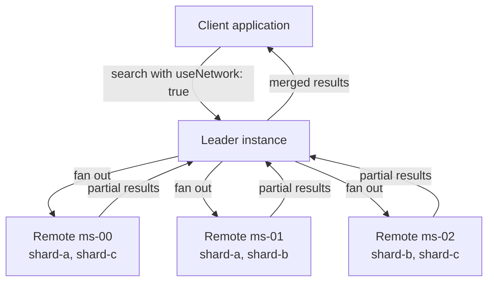

Replication and sharding let you run Meilisearch across multiple instances as a coordinated network. Sharding splits your data across instances so each one handles a smaller portion. Replication duplicates shards across instances so your search stays available if one goes down.

<Note>
Replication and sharding require the Meilisearch Enterprise Edition v1.37 or later. See [Enterprise and Community editions](/resources/self_hosting/enterprise_edition) for details.
</Note>

## What is sharding?

Sharding distributes documents from a single index across multiple Meilisearch instances, called "remotes." Each remote holds one or more named shards containing a subset of your documents.

When a user searches, Meilisearch queries all remotes in the network, collects results from each shard, and merges them into a single ranked response, as if the data lived on one machine.

## What is replication?

Replication assigns the same shard to more than one remote. If one remote becomes unavailable, another remote holding the same shard continues serving results. Meilisearch automatically queries each shard exactly once, avoiding duplicate results even when shards are replicated.

## How it works



1. **Network**: all instances register with each other through the `/network` endpoint, forming a topology with a designated leader
2. **Shards**: the leader distributes document subsets across remotes based on shard assignments
3. **Search**: when `useNetwork: true` is set, the leader fans out the search to all remotes, then merges and ranks the combined results
4. **Failover**: if a remote is down, another remote holding the same shard serves those results

## When to use sharding and replication

| Scenario | Solution |
|----------|----------|
| Dataset too large for a single instance | **Sharding**: split documents across multiple remotes |
| Need high availability | **Replication**: assign each shard to 2+ remotes |
| Geographic distribution | **Sharding + replication**: place remotes closer to users |
| Read throughput bottleneck | **Replication**: distribute search load across replicas |

## The network

All instances in a Meilisearch network share a topology configuration that defines:

- **`self`**: the identity of the current instance
- **`leader`**: the instance coordinating writes and topology changes
- **`remotes`**: all instances in the network with their URLs and search API keys
- **`shards`**: how document subsets are distributed across remotes

The leader instance is responsible for write operations. Non-leader instances reject write requests (document additions, settings changes, index creation) with a `not_a_leader` error.

## Searching across the network

To search across all instances, add `useNetwork: true` to your search request:

```bash
curl \
  -X POST 'MEILISEARCH_URL/indexes/movies/search' \
  -H 'Content-Type: application/json' \
  -H 'Authorization: Bearer MEILISEARCH_KEY' \
  --data-binary '{
    "q": "batman",
    "useNetwork": true
  }'
```

The response includes `_federation` metadata showing which remote each result came from. You can also use the `_shard` filter to target specific shards:

```json
{
  "q": "batman",
  "useNetwork": true,
  "filter": "_shard = \"shard-a\""
}
```

### Network search with multi-search

Network search works with [multi-search](/capabilities/multi_search/getting_started/federated_search) and [federated search](/capabilities/multi_search/getting_started/federated_search). Add `useNetwork: true` to individual queries within a multi-search request:

```bash
curl \
  -X POST 'MEILISEARCH_URL/multi-search' \
  -H 'Content-Type: application/json' \
  -H 'Authorization: Bearer MEILISEARCH_KEY' \
  --data-binary '{
    "queries": [
      { "indexUid": "movies", "q": "batman", "useNetwork": true },
      { "indexUid": "comics", "q": "batman", "useNetwork": true }
    ]
  }'
```

## Feature compatibility

Most Meilisearch features work transparently across a sharded network. The following table highlights important considerations:

| Feature | Works with sharding? | Notes |
|---------|---------------------|-------|
| Full-text search | Yes | Results merged and ranked across all remotes |
| Filtering and sorting | Yes | Filters applied on each remote before merging |
| Faceted search | Yes | Facet counts aggregated across remotes |
| Hybrid/semantic search | Yes | Each remote runs its own vector search, results merged |
| Geo search | Yes | Geographic filters and sorting work across remotes |
| Multi-search | Yes | Use `useNetwork: true` per query |
| Federated search | Yes | Federation merges results from both indexes and remotes |
| Analytics | Partial | Events are tracked on the instance that receives the search request |
| Tenant tokens | Yes | Token filters apply on each remote |
| Document operations | Leader only | Writes must go through the leader instance |
| Settings changes | Leader only | Settings updates must go through the leader |
| Conversational search | Yes | Chat queries can use network search |

## Prerequisites

Before setting up sharding and replication, you need:

- Meilisearch Enterprise Edition v1.37 or later on all instances
- A master key configured on each instance
- Network connectivity between all instances
- If using private networks (`10.x.x.x`, `192.168.x.x`), the `--experimental-allowed-ip-networks` flag must be set on each instance

## Next steps

<CardGroup cols={2}>
  <Card title="Set up a sharded cluster" href="/capabilities/replication_and_sharding/how_to/setup_sharded_cluster">
    Step-by-step guide to configuring sharding and replication.
  </Card>
  <Card title="Manage the network" href="/capabilities/replication_and_sharding/how_to/manage_network">
    Add and remove remotes, update topology, and handle failover.
  </Card>
  <Card title="Federated search" href="/capabilities/multi_search/getting_started/federated_search">
    Merge results from multiple indexes into a single list.
  </Card>
  <Card title="Enterprise Edition" href="/resources/self_hosting/enterprise_edition">
    Learn about the differences between Community and Enterprise editions.
  </Card>
</CardGroup>
