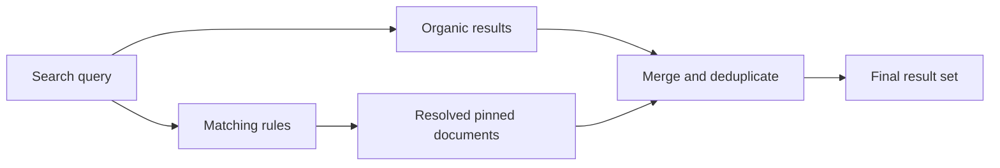

Search rules pin selected documents at fixed positions in search results when specific conditions match. Pinning runs on top of organic search: Meilisearch still ranks results as usual, then inserts the pinned documents at the positions you asked for.

<Warning>
Search rules are experimental. Enable them with `PATCH /experimental-features` before using the API endpoints.
</Warning>

<Note>
The feature is exposed through the `/dynamic-search-rules` API routes and the `dynamicSearchRules` experimental flag. For readability, this documentation refers to it simply as "search rules" everywhere outside of API payloads.

This is different from the [search rules object used in tenant tokens](/capabilities/security/advanced/tenant_token_payload#search-rules), which enforces filters.
</Note>

## When to use search rules

Search rules are a good fit whenever you know exactly which document should appear at which position for a specific query, empty state, or time window. For example, you might pin your billing help article to the top whenever users search for "invoice", feature a seasonal landing page for "summer sale" queries during a time-limited campaign, or curate a default list of onboarding articles for users who open search with an empty query. In each case, organic ranking still decides the rest of the result set. Only the pinned documents are promoted to fixed positions.

For relevancy that adapts to every query, use [ranking rules](/capabilities/full_text_search/relevancy/ranking_rules) or [hybrid search](/capabilities/hybrid_search/overview) instead.

## How search rules work

When a rule matches, Meilisearch:

1. Computes the normal organic results
2. Resolves the pinned documents from the rule
3. Inserts those documents at the requested positions
4. Removes duplicates and returns the final result set

Search rules do not change ranking or scoring. They insert pinned documents on top of the normal results. A pinned document can appear even if it does not match the query text, but filters still apply: if a pinned document does not satisfy the current filters, Meilisearch drops it.

## Key concepts

A rule combines three parts:

- **Conditions** decide when the rule fires. Query conditions match the search string with `contains` (case-insensitive substring) or `isEmpty` (triggered by empty queries). Time conditions activate the rule during a window between a start and end timestamp. Multiple conditions combine with `AND`.
- **Actions** decide what the rule does. Pinning is the only available action today. An action targets one document via `indexUid` and `id`, and places it at a fixed `position` in the result list.
- **Priority** decides which rule wins when several match at once. Lower numeric values take precedence over higher ones. Omitting priority treats the rule as the lowest precedence.

Rules also carry optional metadata such as `description` and an `active` flag that lets you pause a rule without deleting it.

## Use cases

- **Help centers and documentation**: Pin a specific answer when a user's query matches a known topic, so the most helpful article always appears first.
- **E-commerce merchandising**: Promote a campaign landing page or featured product during a sale window, then let the rule expire automatically when the campaign ends.
- **Editorial browse states**: Curate the default list users see when they open search with no query, highlighting starter content or featured collections.
- **Knowledge bases**: Surface operational runbooks or policy pages at the top when support-critical keywords appear, without rebuilding relevance rules.

## Current scope

Search rules apply to regular search, [hybrid search](/capabilities/hybrid_search/overview), [federated search](/capabilities/multi_search/overview), and network search. They do not support:

- Regex, wildcard, or numeric-pattern matching
- Activation from filters, selected facets, locale, user context, or page context
- Actions other than pinning. Boosting, demoting, and burying are planned for future releases.

See [pinning behavior](/capabilities/search_rules/advanced/pinning_behavior) for details on how rules interact with ranking, filters, and precedence. If your use case needs something search rules do not cover yet, [book a call with the Meilisearch team](https://meet.meilisearch.com/meetings/cloud/presentation) to share your requirements.

## Next steps

<CardGroup cols={2}>
  <Card title="Getting started" href="/capabilities/search_rules/getting_started">
    Enable the feature and create your first rule
  </Card>
  <Card title="Pin one result for a query" href="/capabilities/search_rules/how_to/pin_one_result_for_query">
    Start with the most common pinning pattern
  </Card>
  <Card title="Advanced" href="/capabilities/search_rules/advanced/pinning_behavior">
    Matching behavior, precedence, and response details
  </Card>
  <Card title="API reference" href="/reference/api/dynamic-search-rules/update-a-dynamic-search-rule-or-create-a-new-one-if-it-doesnt-exist">
    Endpoints, rule fields, and update behavior
  </Card>
</CardGroup>
