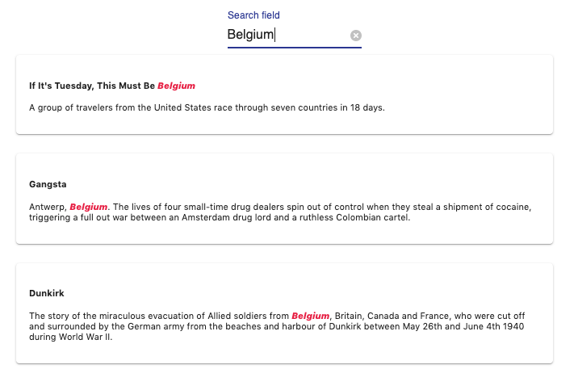
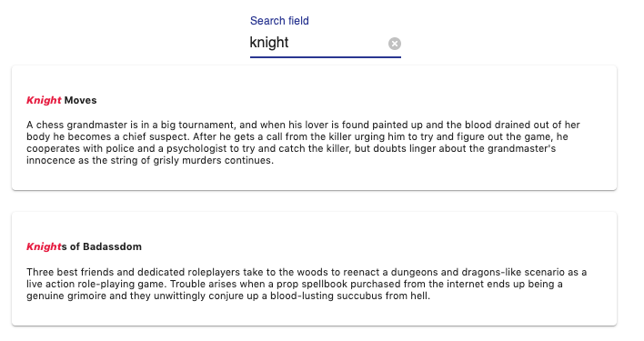

# Relevancy


In meilisearch, the search responses are considered relevant according to a list of rules called **ranking rules**. When a search query is made, it will be compared in different ways with all the documents stored in meilisearch. This comparison will start with the first ranking rule and continue with the next one until the desired number of matching documents has been found.

MeiliSearch proposes default ranking rules and has given them a default order as well. **This order can be modified, rules can be deleted and new ones can be added.**

[For some in depth explanations about the mechanism and about each default sorting rule](https://github.com/meilisearch/MeiliSearch/issues/358).

In order to be able to play with these rules and match them to the needs of your dataset, it is important to understand how each works and how to create new ones.

## Ranking rules

MeiliSearch has built-in ranking rules. These rules are essential to the relevance of the search engine.

Each of the rules has a role in finding the right documents for the given search query.
The order in which the rules are set in the settings affects the importance of the rule. The first rule is the most important, then the second and so on. By default, Meilisearch has these rules in a specific order, thinking it meets the most standard needs. This order can be changed in the settings to fit your needs.

Using a [bucket sort](/advanced_guides/bucket_sort) algorithm, MeiliSearch uses rule by rule to find documents, until the desired amount of documents is obtained.

Here is the list of all the rules that are executed in this specific order by default:

#### 1. Typo
the `typo` rule sorts by ascending number of typos.

This means that a matched word with less typo's is more relevant than a matched word with more typos.

#### 2. Words
The `words` rule sort by decreasing number of matched query words.

#### 3. Proximity
The `proximity` rule sort by increasing proximity of query words in hits.

#### Attribute

The `proximity` rule sort according to the order of attributes.

#### Words position
The `words position` sort according to the position of query words in the attribute. Start is better than end.

#### Exact
The `Exact` - Sort by similarity of the matched words with the query words. Same words are better than prefixes.


## Examples

:::: tabs

::: tab Typo & Word position


### Typo

Matched words :
- `vogli` : 0 typo
- `volli` : 1 typo
- `mogli` : 1 typo

The typo sorts the results by ascending typos on matched query words.

Because `typo` is set as the first rule of our ranking rules, the number of `typos` sorts the document before

### Word position

The reason why `volli` is before `mogli` is because of the `word position` rule. `volli` appears sooner in the title than `mogli`.

:::

::: tab Words & Proximity


### Words

Matched words :
- **Creature**: `road`, `New`, `road` => 3 words.
- **Mississippi Grind**: `new`, `road`, `New` => 3 words.
- **Joy Ride**: `road`, `New` => 2 words.

The `words` ranking rule sorts the results by descending number of matching query words.

### Proximity

The reason why `Creature` is listed before `Mississippi Grind` is because of the `proximity` rule.
The smallest distance between the matching words in `creature` is smaller than the distance of the smallest matching words in `Mississippi Grind`

The proximity rule sorts by descending order of distance length between two matches.
:::


::: tab Attribute


### Attribute

`It's Tuesday, This must be Belgium` is first because the matched word : Belgium, is found in the `title` attribute and not the `description`.

The `attribute` rule sorts by ascending attribute importance.

:::

::: tab Exactness


**Exactness**

`Knight Moves` is displayed before `Knights of Badassdom` because `Knight` is a finished word, exactly the same as the search query. While with `Knights`, the search query is just a prefix.

:::

::::

## Changing the rules order

Depending on your needs, you might want to change the order in which the rules are processed.

For example, in your datasat, the `words` rule that sorts by number of matched query words in a document, could be less important than the `attribute` rule in which we find our matches.

In this case, using the [settings route](/references/settings.md#add-or-replace-index-settings) of your index, you can change the ranking order of the sorting rules.

```json
{
  "rankingOrder": [
       "_typo",
        "_attribute",
        "_proximity",
        "_words",
        "_words_position",
        "_exact",
  ]
}
```

## Creating your rule


## Adding your rule


<!-- What happens when there is no ranking order :
  - Key => value dans la database
  - Du coup au pif les docum qui se trouvent la

 -->


## Custom ranking rules

Custom ranking rules gives you the possibility to add new rules. New rules can be added on attributes that has the `ranked` tag in the [schema](/main_concepts/indexes.md#ranked).

A rule is defined by an **attribute** and a **ascendent** `asc` or **descendent** `dsc` property.

The name of the ranking rule is the name of the attribute on which the rule is made.

For those rules to be applied by MeiliSearch on your search queries, it must be added to the [ranking order](/advanced_guides/ranking.md#ranking-order).

::: warning
If the rule is not added to the rule ranking order, it will be **ignored** by MeiliSearch.
:::

### Example

On the `release_date` attribute of a movie data set, which contains the timestamp of the release date.
```bash
 curl --request POST 'http://localhost:7700/indexes/movies/settings'
  --data '{ "rankingRules": { "release_date": "dsc" } }'
```

We create a custom ranking rule that must have the attribute name as key: `release_date` and we ask it to be `dsc` which means *descending*.

Now if added to the ranking order documents will be ordered by descending release_date.

## Ranking order

The ranking order determine the order of each rule in the [bucket sort](/advanced_guides/bucket_sort).

The default ranking order is as follows ([*see above for more detail about each rule*](/advanced_guides/ranking.md#ranking-rules)):

- `Number of Typos`
- `Number of Words`
- `Words Proximity`
- `Attribute`
- `Position`
- `Exact`

[The ranking order can be changed](/references/settings.md#ranking-rules). Rules can be removed by omitting them in the ranking order list, and custom rules must be added in the ranking order list to be applied.

Each time you create **a new ranking rule it must be added to the existing ranking order to be applied** by the [bucket sort](/advanced_guides/bucket_sort.md).

### Example

To apply the [custom ranking rule added previously](/advanced_guides/ranking.md#custom-ranking-rules), lets add it to the ranking order.

```bash
curl --request POST 'http://localhost:7700/indexes/movies/settings' \
  --data '{
  "rankingOrder": [
    "_sum_of_typos",
    "_number_of_words",
    "_word_proximity",
    "_sum_of_words_attribute",
    "_sum_of_words_position",
    "_exact",
    "release_date"
  ]
}'
```

Now, our **search results will be ordered by descending date** after all other rules have been applied in the [bucket sort](/advanced_guides/bucket_sort).
