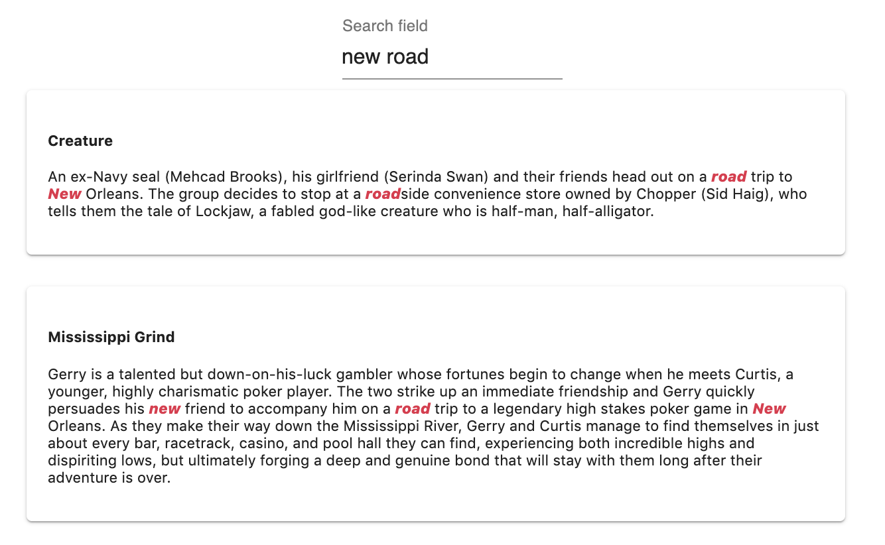
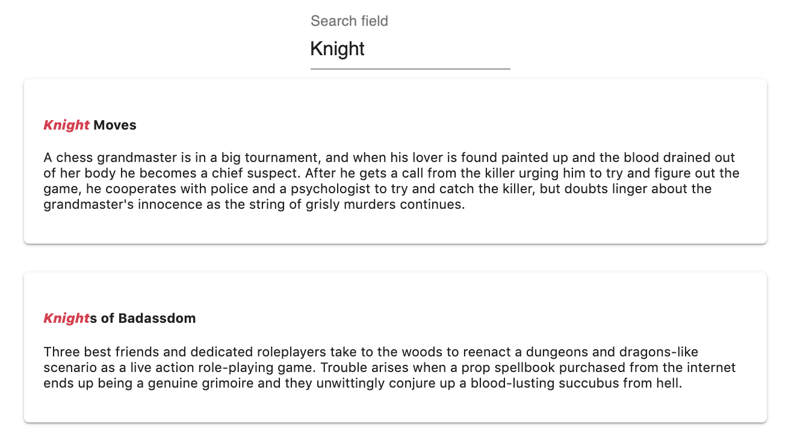

# Relevancy

In MeiliSearch, the search responses are considered relevant according to a list of rules called **ranking rules**. When a search query is made, it will be compared in different ways with all the documents stored in MeiliSearch. This comparison will start with the first ranking rule and continue with the next one until the desired number of matching documents has been found.

MeiliSearch proposes default ranking rules and has given them a default order as well. **This order can be modified, rules can be deleted and new ones can be added.**

[For some in-depth explanations about the mechanism and about each default sorting rule](https://github.com/meilisearch/MeiliSearch/issues/358).

To be able to play with these rules and match them to the needs of your dataset, it is important to understand how each works and how to create new ones.

## Ranking rules

MeiliSearch has built-in ranking rules. These rules are essential to the relevance of the search engine.

Each of the rules has a role in finding the right documents for the given search query.
The order in which the rules are set in the settings affects the importance of the rule. The first rule is the most important, then the second and so on. By default, Meilisearch has these rules in a specific order, thinking it meets the most standard needs. This order can be changed in the settings to fit your needs.

Using a [bucket sort](/advanced_guides/bucket_sort) algorithm, MeiliSearch uses rule by rule to find documents, until the desired amount of documents is obtained.

Here is the list of all the rules that are executed in this specific order by default:

#### 1. Typo
the `typo` rule sorts by ascending numbers of typos.

This means that a matched word with fewer typos is more relevant than a matched word with more typos.

#### 2. Words
The `words` rule sort by decreasing numbers of matched query words.

#### 3. Proximity
The `proximity` rule sort by increasing proximity of query words in hits.

#### 4. Attribute

The `attribute` rule sorts by ascending [attribute importance](/guides/advanced_guides/relevancy.md#attributes-order-of-importance).

#### 5. Words position
The `words position` sort according to the position of query words in the attribute. The start is better than the end.

#### 6. Exact
The `Exact` - Sort by the similarity of the matched words with the query words. Words that are exactly the same are better than prefixes.

#### Examples

:::: tabs

::: tab Typo


### Typo

- `vogli` : 0 typo
- `volli` : 1 typo

The typo sorts the results by ascending typos on matched query words.

Because `typo` is set as the first rule of our ranking rules, the number of `typos` sorts the document before

:::

::: tab Words


### Words

Matched words :
- **The Housemaid**: `Housemaid`, `new`, `house`, `housemaid`, `housework`: 5 words.
- **The open House**: `House`, `new`, `house`: 3 words.

The `words` ranking rule sorts the results by descending number of matching query words.

:::

::: tab Proximity


### Proximity

The reason why `Creature` is listed before `Mississippi Grind` is because of the `proximity` rule.
The smallest **distance** between the matching words in `creature` is smaller than the smallest **distance** between the matching words in `Mississippi Grind`

The proximity rule sorts by descending order of distance length between two matches.
:::

::: tab Attribute


### Attribute

`It's Tuesday, This must be Belgium` is first because the matched word: Belgium, is found in the `title` attribute and not the `description`.

The `attribute` rule sorts by ascending [attribute importance](/guides/advanced_guides/relevancy.md#attributes-order-of-importance).

:::

::: tab Words position


### Word position

`Gangsta` appears sooner than `Dunkirk` because `Belgium` appears sooner in the attribute.

The `word position` rule orders by ascending matching word's index number.

:::

::: tab Exactness


**Exactness**

`Knight Moves` is displayed before `Knights of Badassdom` because `Knight` is a finished word, exactly the same as the search query. While with `Knights`, the search query is just a prefix.

:::

::::

## Order of the rules

Depending on your needs, you might want to change the order in which the rules are processed.

In this case, using the [settings route](/references/settings.md#add-or-replace-index-settings) of your index, you can change the ranking order of the sorting rules.

```json
[
  "_typo",
  "_attribute",
  "_proximity",
  "_words",
  "_words_position",
  "_exact"
]
```

## Adding your rules

New rules can be added to the existing list at any time and anywhere in the existing order.

A custom rule lets you create a descending or ascending sorting rule on a given attribute.
To create a rule, you will need to communicate the attribute on which the rule is created and the order in which it will be sorted: `Asc(attribute_name)` or `Desc(attribute_name)`.

This rule must be added to the existing list of ranking rules using the [settings route](/references/settings.md#add-or-replace-index-settings).

#### Example

```
Desc(release_date)
```
This will create a rule that makes recent movies more relevant than older ones.

```
Asc(movie_ranking)
```
This will create a rule that makes movies with a good rank more relevant than others.

To add this newly created rule to the existing ranking rule, using the [settings route](/references/settings.md#add-or-replace-index-settings), you need to add the rule in the existing order array.

```json
[
  "_typo",
  "_attribute",
  "_proximity",
  "_words",
  "_words_position",
  "_exact",
  "Desc(release_date)",
  "Asc(movie_ranking)"
]
```

## Attributes order of relevancy

In a dataset, some fields are more relevant to the search than others. A `title`, for example, has a value more meaningful to a movie search than its `description` or its `director` name.

By default, MeiliSearch will determine the order of importance of the attributes based on the order in which they appear in the first document added. Then, each new attribute present in new documents will be added to the end of this ordered list.

This means that, for this inference to work, the order of the fields in your dataset must be ordered before they are added to MeiliSearch. Or at least the first document.

### Changing the attributes relevancy order

Possibly, you want to change the order after the documents have been added. This is still very possible.

When a document is added to MeiliSearch, every new attribute inside will be added to two lists :
- [Searchable attributes list](/references/searchable_attributes.md): attributes in which to search for matching query words.
- [Displayed attributes list](/references/displayed_attributes.md): attributes to send back in each document

The once that concerns this section is the Searchable attributes list.

This list is **ordered**. This means that the order in which the attributes appear in the list will determine their relevancy. How sooner they appear in the list, how more important they are.

To change this order, you need to send the sorted-list, in the order you want, using the settings route.

#### Example

```json
[
  "title",
  "description",
  "director"
]
```
With this new order, the matching words found in `title` will make the document more relevant than once with the same matching word found in `description` or `director`.
