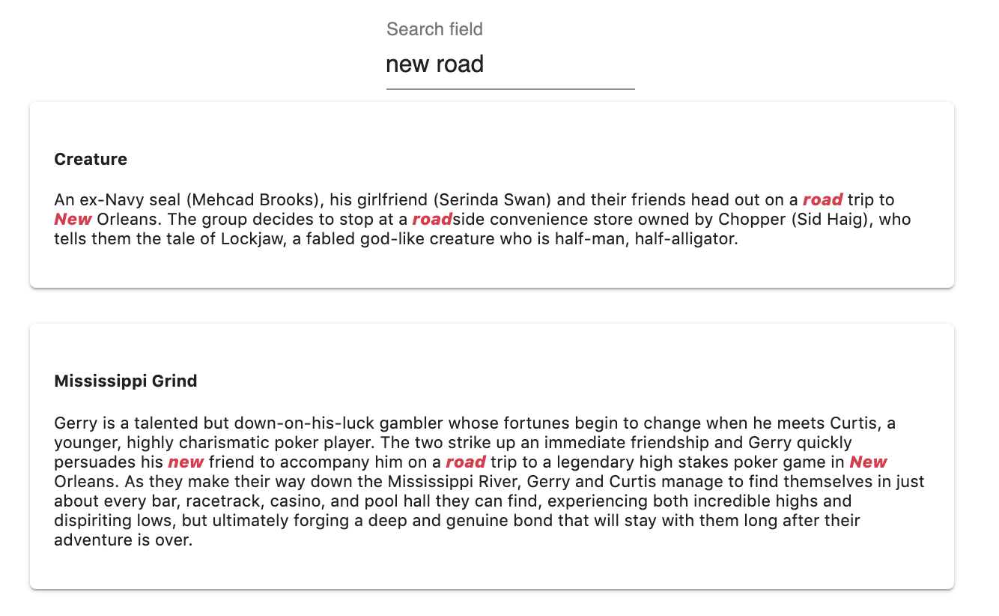
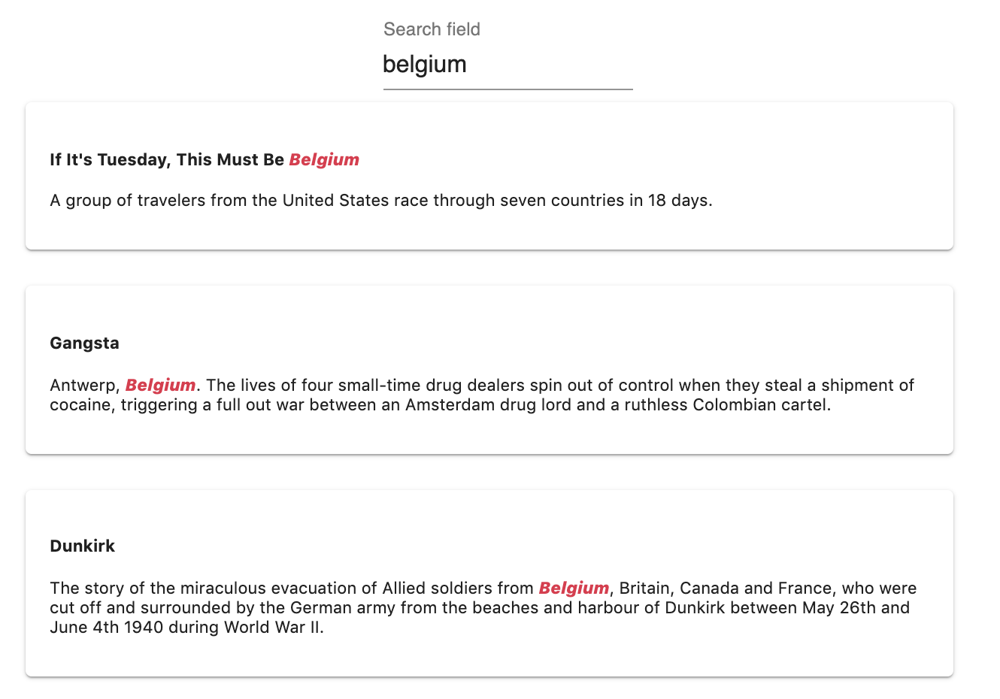
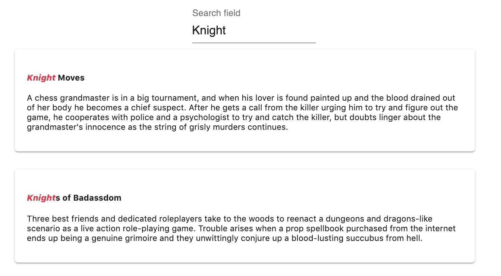

# Relevancy

In MeiliSearch, the search responses are sorted according to a set of consecutive rules called **ranking rules**. When a search query is made, MeiliSearch uses a [bucket sort](/guides/advanced_guides/bucket_sort.md) to rank documents, each rule is applied to all documents that are considered equal according to the previous rule to break the tie.

MeiliSearch proposes default ranking rules and has given them a default order as well. **This order can be modified: rules can be deleted and new ones can be added.**

You can read a more [in-depth explanation about the algorithm and about the default ranking rules](https://github.com/meilisearch/MeiliSearch/issues/358).

To be able to play with these rules and match them to the needs of your dataset, it is important to understand how each works and how to create new ones.

## Ranking rules

MeiliSearch has built-in ranking rules. These rules are essential to the relevance of the search engine.

Each of the rules has a role in finding the right documents for the given search query.
The order in which the rules are set in the settings affects their importance. The first rule is the most important, then the second and so on. By default, MeiliSearch has these rules in a specific order which meets the most standard needs. This order can be changed in the settings.

Here is the list of all the rules that are executed in this specific order by default:

#### 1. Typo

The `typo` rule sorts by ascending numbers of typos.

This means that a document that matches a word with fewer typos is more important than a document that matches with more typos.

#### 2. Words

The `words` rule sorts by comparing the number of query words in each matching document.

The more words of the search query present in a document, the more important it is. Having multiple times the same word doesn't means a document is more important.

::: warning

As of today, all query words must be present in the returned documents. This rule does not impact the search results yet. <Badge text="soon" type="warn"/>

:::

#### 3. Proximity

The `proximity` rule sorts according to the proximity of the query words found in the matching documents.

The more the query words are near each other, and in the right order in a document the more this document is important.

#### 4. Attribute

The `attribute` rule sorts by [attribute importance](/guides/main_concepts/relevancy.md#attributes-importance).

#### 5. Words Position

The `wordsPosition` rule sorts according to the position of the query words in the attribute. The start is better than the end.

#### 6. Exactness

The `exactness` rule sorts by the similarity of the matched words with the query words. Words that are the same are better than prefixes.

#### Examples

:::: tabs

::: tab Typo


### Typo

- `vogli`: 0 typo
- `volli`: 1 typo

The `typo` rule sorts the results by ascending typos on matched query words.

:::

::: tab Proximity


### Proximity

The reason why `Creature` is listed before `Mississippi Grind` is because of the `proximity` rule.<br>
The smallest **distance** between the matching words in `creature` is smaller than the smallest **distance** between the matching words in `Mississippi Grind`.

The `proximity` rule sorts by ascending order of distance length between two matches.
:::

::: tab Attribute


### Attribute

`If It's Tuesday, This must be Belgium` is the first document because the matched word: `Belgium`, is found in the `title` attribute and not the `description`.

The `attribute` rule sorts by ascending [attribute importance](/guides/main_concepts/relevancy.md#attributes-importance).

:::

::: tab Words position


### Word position

`Gangsta` appears before `Dunkirk` because `Belgium` appears sooner in the attribute.

The `word position` rule orders by ascending matching word's index number.

:::

::: tab Exactness


### Exactness

`Knight Moves` is displayed before `Knights of Badassdom` because `Knight` is a complete word, the same as the search query. While with `Knights`, the search query is a prefix of the query word.

:::

::::

## Order of the rules

By default, the built-in rules are in a specific order that MeiliSearch consider the most suitable for common needs.

```json
["typo", "words", "proximity", "attribute", "wordsPosition", "exactness"]
```

Depending on your needs, you might want to change the order of the rules.
You can use the [settings route](/references/ranking_rules.md#update-ranking-rules) of your index to do so.

## Adding your rules

New rules can be added to the existing list at any time and anywhere in the existing order.

A custom rule lets you create a descending or ascending sorting rule on a given attribute.<br>
To create a rule, you need to communicate the attribute on which the rule is created and the order in which it will be sorted: `asc(attribute_name)` or `desc(attribute_name)`.

This rule must be added to the existing list of ranking rules using the [settings route](/references/ranking_rules.md#update-ranking-rules).

#### Example

Let's say we have a dataset of movies. The documents contain the fields `release_date` with a timestamp as value, and `movie_ranking` an integer that represents its ranking.

```
desc(release_date)
```

This will create a rule that makes recent movies more relevant than older ones.

```
asc(movie_ranking)
```

This will create a rule that makes movies with a good rank more relevant than others.

To add this newly created rule to the existing ranking rule, using the [settings route](/references/ranking_rules.md#update-ranking-rules), you need to add the rule in the existing order array.

```json
[
  "typo",
  "attribute",
  "proximity",
  "words",
  "wordsPosition",
  "exactness",
  "desc(release_date)",
  "asc(movie_ranking)"
]
```

## Attributes importance

In a dataset, some fields are more relevant to the search than others. A `title`, for example, has a value more meaningful to a movie search than its `description` or its `director` name.

By default, MeiliSearch will determine the order of importance of the attributes based on the order in which they appear in the first document added. Then, each new attribute present in new documents will be added at the end of this ordered list.

If you wish to specify the order of the attributes you can either define them in the settings, or set the correct order on the first document indexed in MeiliSearch.

### Changing the attributes order

Possibly, you want to change the order after the documents have been added. This is still very possible.

When a document is added to MeiliSearch, every new attribute inside will be added to two lists :

- The [searchable attributes list](/references/searchable_attributes.md): attributes in which to search for matching query words.
- The [displayed attributes list](/references/displayed_attributes.md): attributes in a document that are shown to the user.

The one that concerns this section is the searchable attributes list.

This list is **ordered**. This means that the order in which the attributes appear in the list will determine their relevancy. The earlier they appear in that list, the more important they are.

To change this order, you need to send the sorted-list, in the order you want, using the settings route.

#### Example

```json
["title", "description", "director"]
```

With this new order, the matching words found in `title` will make the document more relevant than one with the same matching words found in `description` or `director`.
