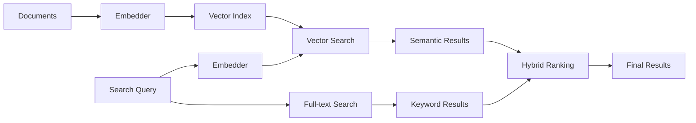

AI-powered search uses machine learning embeddings to understand the *meaning* behind queries, not just matching keywords. Combined with Meilisearch's full-text search, it delivers highly relevant results even when users don't know the exact terms.

## Key features

<CardGroup cols={2}>
  <Card title="Semantic search" icon="brain" href="/products/ai_powered_search/getting_started">
    Find results based on meaning, not just keywords. "affordable housing" matches "budget apartments".
  </Card>
  <Card title="Hybrid search" icon="circle-half-stroke" href="/products/ai_powered_search/difference_full_text_ai_search">
    Combine keyword precision with semantic understanding for the best of both worlds.
  </Card>
  <Card title="Multiple embedders" icon="plug" href="/products/ai_powered_search/choose_an_embedder">
    Use OpenAI, Hugging Face, Cohere, Mistral, or any REST-based embedding provider.
  </Card>
  <Card title="Image search" icon="image" href="/products/ai_powered_search/image_search_with_multimodal_embeddings">
    Search images using text descriptions with multimodal embeddings.
  </Card>
</CardGroup>

## How it works



1. **Indexing**: Documents are converted to vector embeddings capturing semantic meaning
2. **Search**: User queries are also converted to embeddings
3. **Matching**: Similar vectors are found using approximate nearest neighbor search
4. **Hybrid ranking**: Semantic and keyword results are combined for optimal relevancy

## Quick start

### 1. Configure an embedder

```bash
curl -X PATCH "${MEILISEARCH_URL}/indexes/movies/settings" \
  -H "Authorization: Bearer ${MEILISEARCH_API_KEY}" \
  -H 'Content-Type: application/json' \
  --data-binary '{
    "embedders": {
      "default": {
        "source": "openAi",
        "apiKey": "sk-...",
        "model": "text-embedding-3-small",
        "documentTemplate": "A movie titled {{doc.title}} about {{doc.overview}}"
      }
    }
  }'
```

### 2. Add documents

Documents are automatically embedded during indexing:

```bash
curl -X POST "${MEILISEARCH_URL}/indexes/movies/documents" \
  -H "Authorization: Bearer ${MEILISEARCH_API_KEY}" \
  -H 'Content-Type: application/json' \
  --data-binary '[
    {"id": 1, "title": "Inception", "overview": "A thief who steals corporate secrets through dream-sharing technology"},
    {"id": 2, "title": "The Matrix", "overview": "A computer hacker learns about the true nature of reality"}
  ]'
```

### 3. Search semantically

```bash
curl -X POST "${MEILISEARCH_URL}/indexes/movies/search" \
  -H "Authorization: Bearer ${MEILISEARCH_API_KEY}" \
  -H 'Content-Type: application/json' \
  --data-binary '{
    "q": "movies about virtual worlds and technology",
    "hybrid": {
      "embedder": "default",
      "semanticRatio": 0.5
    }
  }'
```

Both "Inception" and "The Matrix" match semantically, even though the query doesn't contain their titles.

## Supported embedders

| Provider | Source | Best for |
|----------|--------|----------|
| [OpenAI](/guides/ai_embedders/providers/openai) | `openAi` | General-purpose, high quality |
| [Hugging Face](/guides/ai_embedders/providers/huggingface) | `huggingFace` | Open-source, self-hosted |
| [Cohere](/guides/ai_embedders/providers/cohere) | `rest` | Multilingual, specialized models |
| [Mistral](/guides/ai_embedders/providers/mistral) | `rest` | European hosting, multilingual |
| [Cloudflare](/guides/ai_embedders/providers/cloudflare) | `rest` | Edge deployment |
| [Voyage AI](/guides/ai_embedders/providers/voyage) | `rest` | Domain-specific models |
| Custom | `rest` or `userProvided` | Any embedding API |

## Hybrid search tuning

Control the balance between semantic and keyword search:

```json
{
  "hybrid": {
    "embedder": "default",
    "semanticRatio": 0.5
  }
}
```

| `semanticRatio` | Behavior |
|-----------------|----------|
| `0.0` | Pure keyword search |
| `0.5` | Equal weight (recommended starting point) |
| `1.0` | Pure semantic search |

## Use cases

<CardGroup cols={2}>
  <Card title="E-commerce" icon="cart-shopping">
    "comfortable work shoes" finds "ergonomic office footwear"
  </Card>
  <Card title="Documentation" icon="book">
    "how to deploy" finds "installation guide" and "setup instructions"
  </Card>
  <Card title="Support tickets" icon="headset">
    Find similar past issues even with different wording
  </Card>
  <Card title="Content discovery" icon="compass">
    "relaxing weekend activities" finds relevant articles
  </Card>
</CardGroup>

## Comparison: Full-text vs AI-powered

| Aspect | Full-text search | AI-powered search |
|--------|------------------|-------------------|
| Matching | Exact/fuzzy keywords | Semantic meaning |
| Typos | Handled automatically | N/A (meaning-based) |
| Synonyms | Must be configured | Understood automatically |
| Speed | Fastest | Fast (slight overhead) |
| Best for | Known-item search | Exploratory search |

[Learn more about the differences →](/products/ai_powered_search/difference_full_text_ai_search)

## Next steps

<CardGroup cols={2}>
  <Card title="Get started" icon="rocket" href="/products/ai_powered_search/getting_started">
    Set up AI-powered search step by step
  </Card>
  <Card title="Choose an embedder" icon="plug" href="/products/ai_powered_search/choose_an_embedder">
    Compare embedding providers
  </Card>
  <Card title="Conversational search" icon="comments" href="/products/conversational_search/getting_started">
    Build chat interfaces with RAG
  </Card>
  <Card title="Image search" icon="image" href="/products/ai_powered_search/image_search_with_multimodal_embeddings">
    Search images with text
  </Card>
</CardGroup>
