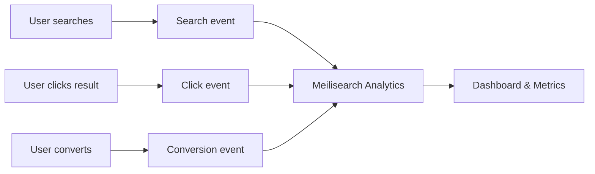

Meilisearch Cloud analytics help you understand how users search your data, measure result quality, and identify opportunities to improve relevancy. Track searches, clicks, and conversions to make data-driven decisions.

<Note>
Analytics is a Meilisearch Cloud feature.
</Note>

## Key features

<CardGroup cols={2}>
  <Card title="Search analytics" icon="chart-line" href="/products/analytics/track_click_events">
    Track queries, result counts, and search patterns.
  </Card>
  <Card title="Click tracking" icon="mouse-pointer" href="/products/analytics/bind_events_user">
    Measure which results users click on.
  </Card>
  <Card title="Conversion tracking" icon="cart-shopping">
    Track when searches lead to desired actions.
  </Card>
  <Card title="User binding" icon="user" href="/products/analytics/bind_events_user">
    Associate events with users for cohort analysis.
  </Card>
</CardGroup>

## How it works



1. **Configure analytics** in your Meilisearch Cloud project
2. **Send events** from your application when users search, click, or convert
3. **View metrics** in the Cloud dashboard
4. **Optimize** based on insights

## Quick start

### 1. Enable analytics

Analytics is enabled by default in Meilisearch Cloud. Configure it in your project settings.

### 2. Send search events

Include the analytics header in search requests:

```bash
curl -X POST "${MEILISEARCH_URL}/indexes/products/search" \
  -H "Authorization: Bearer ${MEILISEARCH_API_KEY}" \
  -H 'Content-Type: application/json' \
  -H 'X-Meilisearch-Client: your-app-name' \
  --data-binary '{
    "q": "wireless headphones"
  }'
```

### 3. Track click events

When a user clicks a search result:

```bash
curl -X POST "${MEILISEARCH_URL}/analytics/events" \
  -H "Authorization: Bearer ${MEILISEARCH_API_KEY}" \
  -H 'Content-Type: application/json' \
  --data-binary '{
    "type": "click",
    "searchId": "abc123",
    "documentId": "product_456",
    "position": 3
  }'
```

### 4. Track conversions

When a user completes a desired action:

```bash
curl -X POST "${MEILISEARCH_URL}/analytics/events" \
  -H "Authorization: Bearer ${MEILISEARCH_API_KEY}" \
  -H 'Content-Type: application/json' \
  --data-binary '{
    "type": "conversion",
    "searchId": "abc123",
    "documentId": "product_456"
  }'
```

## Event types

| Event | Description | Use case |
|-------|-------------|----------|
| **Search** | Automatic when searching | Track all queries |
| **Click** | User clicks a result | Measure engagement |
| **Conversion** | User completes action | Track business outcomes |
| **Custom** | Any custom event | Specific use cases |

## Key metrics

### Search metrics

| Metric | Description |
|--------|-------------|
| **Total searches** | Number of search queries |
| **Zero-result rate** | Percentage of searches with no results |
| **Average results** | Mean number of results per search |
| **Popular queries** | Most frequent search terms |

### Engagement metrics

| Metric | Description |
|--------|-------------|
| **Click-through rate (CTR)** | % of searches with at least one click |
| **Mean reciprocal rank (MRR)** | How high clicked results rank |
| **Clicks per search** | Average number of clicks per query |

### Conversion metrics

| Metric | Description |
|--------|-------------|
| **Conversion rate** | % of searches leading to conversion |
| **Time to conversion** | How long from search to convert |
| **Revenue per search** | Average value from searches |

## Use cases

<CardGroup cols={2}>
  <Card title="Improve relevancy" icon="ranking-star">
    Identify searches with low CTR and tune ranking
  </Card>
  <Card title="Fill content gaps" icon="magnifying-glass-minus">
    Find high-volume zero-result queries
  </Card>
  <Card title="Measure ROI" icon="chart-line">
    Track search-driven conversions
  </Card>
  <Card title="A/B testing" icon="vials">
    Compare different configurations
  </Card>
</CardGroup>

## Best practices

### Track meaningful events

Focus on events that indicate success:

- **E-commerce**: Add to cart, purchase
- **Content**: Read article, share
- **SaaS**: Sign up, upgrade

### Bind events to users

Associate events with user IDs for better analysis:

```json
{
  "type": "click",
  "searchId": "abc123",
  "documentId": "product_456",
  "userId": "user_789"
}
```

### Use search IDs

The search ID links events to specific queries:

```javascript
// Get search ID from response
const { hits, searchId } = await index.search('headphones');

// Send click event with same ID
await sendClickEvent({
  searchId,
  documentId: hits[0].id,
  position: 1
});
```

### Monitor zero-result searches

High-value queries with no results are opportunities:

- Add synonyms for alternative terms
- Expand searchable attributes
- Add missing content

## Integration examples

### JavaScript

```javascript
import { MeiliSearch } from 'meilisearch';

const client = new MeiliSearch({
  host: process.env.MEILISEARCH_URL,
  apiKey: process.env.MEILISEARCH_API_KEY
});

// Search
const results = await client.index('products').search('laptop');

// Track click
await fetch(`${process.env.MEILISEARCH_URL}/analytics/events`, {
  method: 'POST',
  headers: {
    'Authorization': `Bearer ${process.env.MEILISEARCH_API_KEY}`,
    'Content-Type': 'application/json'
  },
  body: JSON.stringify({
    type: 'click',
    searchId: results.searchId,
    documentId: clickedProduct.id,
    position: clickPosition
  })
});
```

### React with InstantSearch

```jsx
function Hit({ hit, position, searchId }) {
  const trackClick = () => {
    fetch('/api/analytics/click', {
      method: 'POST',
      body: JSON.stringify({
        searchId,
        documentId: hit.id,
        position
      })
    });
  };

  return (
    <a href={hit.url} onClick={trackClick}>
      {hit.title}
    </a>
  );
}
```

## Next steps

<CardGroup cols={2}>
  <Card title="Configure events" icon="gear" href="/products/analytics/track_click_events">
    Set up analytics tracking
  </Card>
  <Card title="Bind to users" icon="user" href="/products/analytics/bind_events_user">
    Associate events with users
  </Card>
  <Card title="Events API" icon="code" href="/products/analytics/events_endpoint">
    API reference for events
  </Card>
  <Card title="Metrics reference" icon="chart-bar" href="/products/analytics/analytics_metrics_reference">
    All available metrics
  </Card>
</CardGroup>
