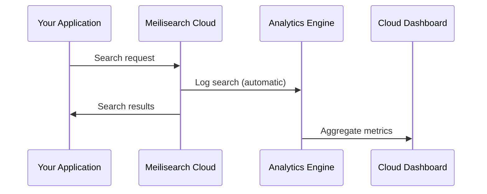

Search analytics are collected automatically for every search request in Meilisearch Cloud. No configuration or code changes required—just search, and the data flows to your dashboard.

## What's tracked automatically

Every search request provides the following data:

| Metric | Description |
|--------|-------------|
| **Total searches** | Number of search queries in the selected period |
| **Total users** | Unique users who performed searches |
| **No-result rate** | Percentage of searches returning zero results |
| **Search latency** | Time between request and response |
| **Most searched queries** | Top queries by frequency |
| **Searches without results** | Queries that returned nothing |
| **Geographic distribution** | Countries where searches originated |

## How it works



1. Your application sends a search request to Meilisearch Cloud
2. Meilisearch automatically logs the query, user, and performance data
3. The analytics engine aggregates data over time
4. Metrics appear in your Cloud dashboard

## Improving user tracking accuracy

By default, Meilisearch generates a unique user ID for each request without an explicit ID. This can inflate your "total users" count.

For accurate user metrics, include a user ID with your search requests:

```bash
curl -X POST "${MEILISEARCH_URL}/indexes/products/search" \
  -H "Authorization: Bearer ${MEILISEARCH_API_KEY}" \
  -H "Content-Type: application/json" \
  -H "X-MS-USER-ID: user_123" \
  --data-binary '{
    "q": "wireless headphones"
  }'
```

Use any consistent identifier:
- Authenticated user ID from your system
- Hashed IP address for anonymous users
- Session ID for guest users

## Using search analytics data

### Find content gaps

The "searches without results" metric reveals what users want but can't find:

<Frame>
  
</Frame>

**Actions to take:**
- Add synonyms for alternative terms users type
- Expand searchable attributes to include relevant fields
- Add missing content to your index

### Identify popular content

The "most searched queries" metric shows what users care about:

<Frame>
  
</Frame>

**Actions to take:**
- Ensure top queries return high-quality results
- Consider boosting popular content in ranking
- Create landing pages for high-volume searches

### Monitor performance

Search latency metrics help identify performance issues:

**Actions to take:**
- Investigate latency spikes
- Optimize index settings if searches are slow
- Consider scaling your project for high-volume periods

## Comparing time periods

The dashboard lets you compare metrics across different time periods:

<Frame>
  
</Frame>

Use this to:
- Measure impact of search configuration changes
- Track seasonal trends
- Identify anomalies in search behavior

## Next steps

Search analytics show you what users search for. To understand what they do with results, set up event tracking:

<CardGroup cols={2}>
  <Card title="Track clicks" icon="mouse-pointer" href="/products/analytics/track_click_events">
    Measure which results users click
  </Card>
  <Card title="Track conversions" icon="cart-shopping" href="/products/analytics/track_conversion_events">
    Measure business outcomes
  </Card>
</CardGroup>
