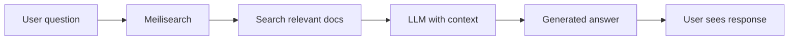

Conversational search combines Meilisearch's search capabilities with large language models (LLMs) to create chat interfaces that answer questions based on your data. Users ask questions in natural language and receive AI-generated answers grounded in your indexed content.

## Key features

<CardGroup cols={2}>
  <Card title="RAG-powered answers" icon="robot" href="/products/conversational_search/getting_started">
    LLMs generate responses using your actual data, reducing hallucinations.
  </Card>
  <Card title="OpenAI-compatible API" icon="plug" href="/reference/api/chats">
    Works with OpenAI SDKs and any OpenAI-compatible client.
  </Card>
  <Card title="Multiple LLM providers" icon="brain">
    Use OpenAI, Mistral, Gemini, Azure OpenAI, or self-hosted models.
  </Card>
  <Card title="Streaming responses" icon="wave-pulse">
    Real-time streaming for responsive chat experiences.
  </Card>
</CardGroup>

## How it works



1. **User asks a question** in natural language
2. **Meilisearch searches** your indexes for relevant documents
3. **Context is sent to LLM** along with the user's question
4. **LLM generates an answer** based on your data
5. **Response streams back** to the user

This is called **Retrieval-Augmented Generation (RAG)** — the LLM's responses are grounded in your actual data.

## Quick start

### 1. Enable chat completions (experimental)

```bash
curl -X PATCH "${MEILISEARCH_URL}/experimental-features/" \
  -H "Authorization: Bearer ${MEILISEARCH_API_KEY}" \
  -H 'Content-Type: application/json' \
  --data-binary '{ "chatCompletions": true }'
```

### 2. Create a chat workspace

```bash
curl -X PATCH "${MEILISEARCH_URL}/chats/support-bot/settings" \
  -H "Authorization: Bearer ${MEILISEARCH_API_KEY}" \
  -H 'Content-Type: application/json' \
  --data-binary '{
    "source": "openAi",
    "apiKey": "sk-...",
    "prompts": {
      "system": "You are a helpful support assistant. Answer questions based on the documentation provided."
    }
  }'
```

### 3. Configure index for chat

```bash
curl -X PATCH "${MEILISEARCH_URL}/indexes/docs/settings/chat" \
  -H "Authorization: Bearer ${MEILISEARCH_API_KEY}" \
  -H 'Content-Type: application/json' \
  --data-binary '{
    "description": "Product documentation and help articles",
    "documentTemplate": "# {{doc.title}}\n\n{{doc.content}}"
  }'
```

### 4. Chat with your data

Using the OpenAI-compatible API:

```bash
curl -N -X POST "${MEILISEARCH_URL}/chats/support-bot/chat/completions" \
  -H "Authorization: Bearer ${MEILISEARCH_API_KEY}" \
  -H 'Content-Type: application/json' \
  --data-binary '{
    "model": "gpt-4o-mini",
    "messages": [
      { "role": "user", "content": "How do I reset my password?" }
    ],
    "stream": true
  }'
```

Or with the OpenAI SDK:

```python
import os
from openai import OpenAI

client = OpenAI(
    base_url=f"{os.environ.get('MEILISEARCH_URL')}/chats/support-bot",
    api_key=os.environ.get("MEILISEARCH_API_KEY")
)

response = client.chat.completions.create(
    model="gpt-4o-mini",
    messages=[{"role": "user", "content": "How do I reset my password?"}],
    stream=True
)

for chunk in response:
    print(chunk.choices[0].delta.content or "", end="")
```

## Supported LLM providers

| Provider | Source | Notes |
|----------|--------|-------|
| OpenAI | `openAi` | GPT-4o, GPT-4o-mini, etc. |
| Azure OpenAI | `azureOpenAi` | Enterprise Azure deployment |
| Mistral | `mistral` | European hosting |
| Google Gemini | `gemini` | Gemini Pro models |
| vLLM | `vLlm` | Self-hosted open models |

### Configure different providers

<Tabs>
  <Tab title="OpenAI">
```json
{
  "source": "openAi",
  "apiKey": "sk-..."
}
```
  </Tab>
  <Tab title="Mistral">
```json
{
  "source": "mistral",
  "apiKey": "..."
}
```
  </Tab>
  <Tab title="Self-hosted">
```json
{
  "source": "vLlm",
  "baseUrl": "http://your-server:8000"
}
```
  </Tab>
</Tabs>

## Key concepts

### Workspaces

A workspace is a chat configuration that defines:
- Which LLM provider to use
- System prompts and behavior
- Which indexes to search

### Index chat settings

Each index can have chat-specific settings:

```json
{
  "description": "Helps the LLM understand what data this index contains",
  "documentTemplate": "How documents are formatted when sent to the LLM",
  "searchParameters": {
    "limit": 20,
    "hybrid": { "embedder": "default" }
  }
}
```

### System prompts

Control the LLM's behavior and personality:

```json
{
  "prompts": {
    "system": "You are a friendly product expert. Only answer questions about our products. If unsure, say so."
  }
}
```

## Use cases

<CardGroup cols={2}>
  <Card title="Customer support" icon="headset">
    Answer questions from your knowledge base
  </Card>
  <Card title="Documentation search" icon="book">
    Help users find and understand docs
  </Card>
  <Card title="Product discovery" icon="cart-shopping">
    Natural language product questions
  </Card>
  <Card title="Internal tools" icon="building">
    Query company data conversationally
  </Card>
</CardGroup>

## When to use conversational vs traditional search

**Use conversational search when:**
- Users need easy-to-read answers to specific questions
- You are handling information-dense content, such as knowledge bases
- Natural language interaction improves user experience

**Use traditional search when:**
- Users need to browse multiple options, such as an e-commerce website
- Approximate answers are not acceptable
- Your users need very quick responses

<Tip>
**Alternative: Model Context Protocol (MCP)**

For use cases where having up-to-date data is more important than comprehensive answers, consider using an [MCP server](/guides/ai_embedders/mcp) instead of the chat completions API.
</Tip>

## Best practices

### Write good document templates

Help the LLM understand your data:

```json
{
  "documentTemplate": "Product: {{doc.name}}\nCategory: {{doc.category}}\nDescription: {{doc.description}}\nPrice: ${{doc.price}}"
}
```

### Use descriptive index descriptions

```json
{
  "description": "E-commerce product catalog with electronics, clothing, and home goods. Contains product names, descriptions, prices, and specifications."
}
```

### Set appropriate limits

```json
{
  "searchParameters": {
    "limit": 10
  }
}
```

More documents = more context = better answers, but also higher LLM costs.

### Combine with AI-powered search

Use hybrid search for better document retrieval:

```json
{
  "searchParameters": {
    "hybrid": {
      "embedder": "default",
      "semanticRatio": 0.5
    }
  }
}
```

## Next steps

<CardGroup cols={2}>
  <Card title="Get started" icon="rocket" href="/products/conversational_search/getting_started">
    Step-by-step setup guide
  </Card>
  <Card title="Chat API reference" icon="code" href="/reference/api/chats">
    Complete API documentation
  </Card>
  <Card title="Configure chat settings" icon="gear" href="/reference/api/settings/chat">
    Index chat settings reference
  </Card>
</CardGroup>
