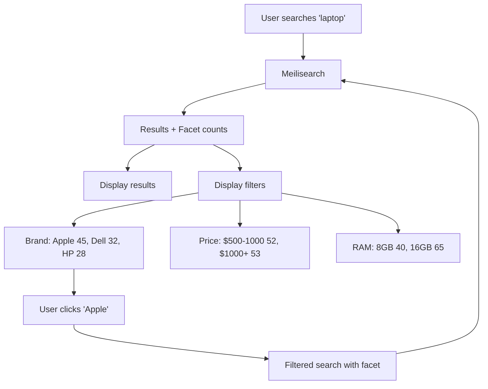

Faceted search lets users narrow down results by selecting attribute values like category, brand, price range, or color. It's the drill-down navigation you see on e-commerce sites and product catalogs.

<Note>
**Facets vs filters:** Meilisearch does not differentiate between facets and filters. Facets are a specific use-case of filters — any attribute added to `filterableAttributes` can be used as a facet. Whether something is a "filter" or a "facet" depends on your UI design.
</Note>

## Key features

<CardGroup cols={2}>
  <Card title="Filtering" icon="filter" href="/products/faceted_search/filter_search_results">
    Narrow results by exact values, ranges, or complex conditions.
  </Card>
  <Card title="Facet counts" icon="list-ol" href="/products/faceted_search/search_with_facet_filters">
    Show how many results exist for each filter option.
  </Card>
  <Card title="Sorting" icon="arrow-up-wide-short" href="/products/faceted_search/sort_search_results">
    Order results by price, date, rating, or any attribute.
  </Card>
  <Card title="Geo filtering" icon="location-dot" href="/products/geo_search/geosearch">
    Filter by location and distance.
  </Card>
</CardGroup>

## How it works



1. **Configure filterable attributes** - Tell Meilisearch which fields can be filtered
2. **Search with facets** - Request facet distribution in search queries
3. **Display facet counts** - Show users how many results match each option
4. **Apply filters** - When users select options, add filter expressions to queries

## Quick start

### 1. Configure filterable attributes

```bash
curl -X PATCH "${MEILISEARCH_URL}/indexes/products/settings" \
  -H "Authorization: Bearer ${MEILISEARCH_API_KEY}" \
  -H 'Content-Type: application/json' \
  --data-binary '{
    "filterableAttributes": ["brand", "category", "price", "rating"],
    "sortableAttributes": ["price", "rating"]
  }'
```

### 2. Search with facets

```bash
curl -X POST "${MEILISEARCH_URL}/indexes/products/search" \
  -H "Authorization: Bearer ${MEILISEARCH_API_KEY}" \
  -H 'Content-Type: application/json' \
  --data-binary '{
    "q": "laptop",
    "facets": ["brand", "category"]
  }'
```

**Response includes facet distribution:**

```json
{
  "hits": [...],
  "facetDistribution": {
    "brand": {
      "Apple": 45,
      "Dell": 32,
      "HP": 28,
      "Lenovo": 25
    },
    "category": {
      "Ultrabook": 52,
      "Gaming": 38,
      "Business": 40
    }
  }
}
```

### 3. Apply filters

```bash
curl -X POST "${MEILISEARCH_URL}/indexes/products/search" \
  -H "Authorization: Bearer ${MEILISEARCH_API_KEY}" \
  -H 'Content-Type: application/json' \
  --data-binary '{
    "q": "laptop",
    "filter": "brand = Apple AND price < 2000",
    "facets": ["brand", "category"],
    "sort": ["price:asc"]
  }'
```

## Filter expression syntax

| Operation | Syntax | Example |
|-----------|--------|---------|
| Equality | `attribute = value` | `brand = "Apple"` |
| Inequality | `attribute != value` | `status != "sold"` |
| Comparison | `>`, `>=`, `<`, `<=` | `price >= 100` |
| Range | `attribute value1 TO value2` | `price 100 TO 500` |
| IN | `attribute IN [values]` | `brand IN ["Apple", "Dell"]` |
| EXISTS | `attribute EXISTS` | `discount EXISTS` |
| IS NULL | `attribute IS NULL` | `description IS NULL` |
| IS EMPTY | `attribute IS EMPTY` | `tags IS EMPTY` |
| AND | `condition AND condition` | `brand = "Apple" AND price < 1000` |
| OR | `condition OR condition` | `category = "Phone" OR category = "Tablet"` |
| NOT | `NOT condition` | `NOT brand = "Generic"` |

[Full filter expression reference →](/products/faceted_search/filter_expression_reference)

## Facet statistics

For numeric fields, get min/max/distribution:

```bash
curl -X POST "${MEILISEARCH_URL}/indexes/products/search" \
  -H "Authorization: Bearer ${MEILISEARCH_API_KEY}" \
  -H 'Content-Type: application/json' \
  --data-binary '{
    "q": "laptop",
    "facets": ["price"]
  }'
```

```json
{
  "facetStats": {
    "price": {
      "min": 299,
      "max": 3499
    }
  }
}
```

## Use cases

<CardGroup cols={2}>
  <Card title="E-commerce" icon="cart-shopping">
    Filter by brand, price, size, color, rating
  </Card>
  <Card title="Job boards" icon="briefcase">
    Filter by location, salary, experience, remote
  </Card>
  <Card title="Real estate" icon="house">
    Filter by price, bedrooms, location, amenities
  </Card>
  <Card title="Content libraries" icon="photo-film">
    Filter by genre, year, rating, duration
  </Card>
</CardGroup>

## Best practices

### Choose filterable attributes wisely

Only make attributes filterable if users need to filter by them. Each filterable attribute increases index size.

```json
{
  "filterableAttributes": ["brand", "category", "price"]
}
```

### Use `sortableAttributes` for ordering

```json
{
  "sortableAttributes": ["price", "rating", "created_at"]
}
```

### Combine filters and sorting

```json
{
  "filter": "category = 'Electronics' AND price < 500",
  "sort": ["rating:desc", "price:asc"]
}
```

### Handle dates properly

Store dates as timestamps for range filtering:

```json
{
  "filter": "created_at >= 1704067200 AND created_at < 1706745600"
}
```

[Working with dates →](/products/faceted_search/working_with_dates)

## Next steps

<CardGroup cols={2}>
  <Card title="Filter search results" icon="filter" href="/products/faceted_search/filter_search_results">
    Deep dive into filtering
  </Card>
  <Card title="Facet filters" icon="list-check" href="/products/faceted_search/search_with_facet_filters">
    Build faceted navigation
  </Card>
  <Card title="Sorting" icon="arrow-up-wide-short" href="/products/faceted_search/sort_search_results">
    Order results by attributes
  </Card>
  <Card title="Geo search" icon="location-dot" href="/products/geo_search/geosearch">
    Filter by location
  </Card>
</CardGroup>
