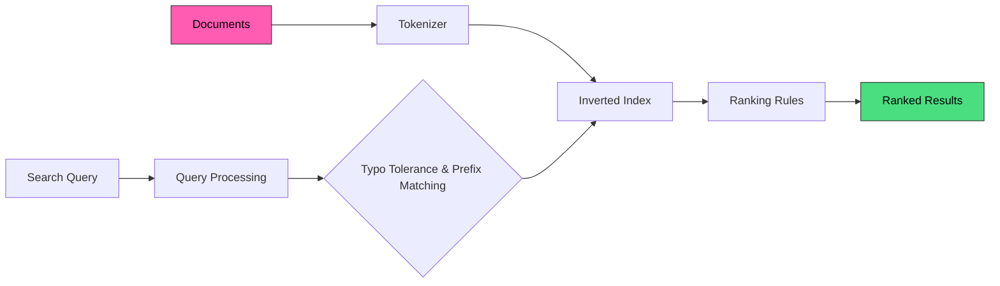

Full-text search is Meilisearch's core capability. It allows users to search through text content and receive relevant results in milliseconds, even with typos or partial queries.

## Key features

<CardGroup cols={2}>
  <Card title="Typo tolerance" icon="spell-check" href="/products/full_text_search/typo_tolerance_settings">
    Meilisearch automatically handles typos and misspellings, returning relevant results even when users make mistakes.
  </Card>
  <Card title="Prefix search" icon="magnifying-glass" href="/products/full_text_search/query_processing">
    Results appear as users type, enabling search-as-you-type experiences without waiting for complete queries.
  </Card>
  <Card title="Ranking & relevancy" icon="ranking-star" href="/products/full_text_search/ranking_rules">
    Configure how results are ranked using built-in and custom ranking rules to match your use case.
  </Card>
  <Card title="Synonyms" icon="arrows-left-right" href="/products/full_text_search/synonyms">
    Define word equivalences so users find results regardless of the exact terms they use.
  </Card>
</CardGroup>

## How it works



1. **Index**: documents are tokenized and stored in an inverted index
2. **Search**: the query is processed with typo tolerance and prefix matching
3. **Rank**: results are ordered by [ranking rules](/products/full_text_search/ranking_rules)
4. **Return**: top results are delivered in milliseconds

## Quick start

```bash
# Add documents
curl -X POST "${MEILISEARCH_URL}/indexes/movies/documents" \
  -H "Authorization: Bearer ${MEILISEARCH_API_KEY}" \
  -H 'Content-Type: application/json' \
  --data-binary '[
    {"id": 1, "title": "The Dark Knight", "genre": "Action"},
    {"id": 2, "title": "Inception", "genre": "Sci-Fi"}
  ]'

# Search with typo
curl -X POST "${MEILISEARCH_URL}/indexes/movies/search" \
  -H "Authorization: Bearer ${MEILISEARCH_API_KEY}" \
  -H 'Content-Type: application/json' \
  --data-binary '{"q": "dar knigt"}'
```

Even with "dar knigt" (typos), Meilisearch returns "The Dark Knight".

## Customization options

| Feature | Description | Documentation |
|---------|-------------|---------------|
| Searchable attributes | Control which fields are searched | [Learn more](/products/full_text_search/displayed_searchable_attributes) |
| Ranking rules | Customize result ordering | [Learn more](/products/full_text_search/ranking_rules) |
| Custom ranking | Add business-specific sorting | [Learn more](/products/full_text_search/custom_ranking_rules) |
| Stop words | Ignore common words | [API reference](/reference/api/settings/get-stopwords) |
| Synonyms | Define equivalent terms | [Learn more](/products/full_text_search/synonyms) |
| Typo tolerance | Fine-tune error handling | [Learn more](/products/full_text_search/typo_tolerance_settings) |

## Use cases

<CardGroup cols={2}>
  <Card title="Product catalogs" icon="cart-shopping">
    Search by name, description, brand across your product inventory
  </Card>
  <Card title="Content sites" icon="newspaper">
    Search articles, documentation, and blog posts
  </Card>
  <Card title="User directories" icon="address-book">
    Find users by name, email, or profile information
  </Card>
  <Card title="Text-heavy datasets" icon="file-lines">
    Any dataset where keyword matching matters
  </Card>
</CardGroup>

## Combine with other capabilities

Full-text search works seamlessly with:

- [**Filtering**](/products/faceted_search/filter_search_results) - Narrow results by attributes
- [**Sorting**](/products/faceted_search/sort_search_results) - Order by price, date, etc.
- [**AI-powered search**](/products/hybrid_search/getting_started) - Hybrid semantic + keyword search
- [**Faceted search**](/products/faceted_search/search_with_facet_filters) - Enable drill-down navigation

## Next steps

<CardGroup cols={2}>
  <Card title="Configure relevancy" icon="sliders" href="/products/full_text_search/ranking_rules">
    Learn how Meilisearch determines result ranking
  </Card>
  <Card title="Typo tolerance" icon="spell-check" href="/products/full_text_search/typo_tolerance_settings">
    Fine-tune how typos are handled
  </Card>
</CardGroup>
