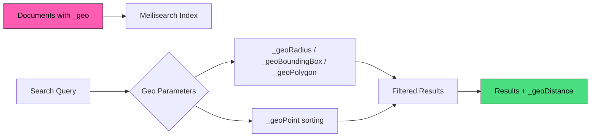

Geo search enables location-based filtering and sorting. Find nearby restaurants, sort stores by distance, or filter listings within a geographic area.

## Key features

<CardGroup cols={2}>
  <Card title="Radius filtering" icon="circle" href="/products/geo_search/filtering">
    Find results within a distance from a point using `_geoRadius`.
  </Card>
  <Card title="Bounding box" icon="vector-square" href="/products/geo_search/filtering">
    Filter results within a rectangular area using `_geoBoundingBox`.
  </Card>
  <Card title="Polygon filtering" icon="draw-polygon" href="/products/geo_search/filtering">
    Filter results within custom shapes using `_geoPolygon`.
  </Card>
  <Card title="Distance sorting" icon="arrow-down-short-wide" href="/products/geo_search/sorting">
    Sort results by distance from a location using `_geoPoint`.
  </Card>
</CardGroup>

## How it works



1. **Index documents** with `_geo` coordinates (latitude and longitude)
2. **Configure** `_geo` as a filterable and/or sortable attribute
3. **Search** using geo filters to limit results to a geographic area
4. **Sort** results by distance from a reference point

## Quick start

### 1. Add documents with location

```json
[
  {
    "id": 1,
    "name": "Sushi Palace",
    "_geo": { "lat": 48.8566, "lng": 2.3522 }
  },
  {
    "id": 2,
    "name": "Pizza Roma",
    "_geo": { "lat": 48.8606, "lng": 2.3376 }
  }
]
```

### 2. Configure geo attributes

```bash
curl -X PATCH "${MEILISEARCH_URL}/indexes/restaurants/settings" \
  -H "Authorization: Bearer ${MEILISEARCH_API_KEY}" \
  -H "Content-Type: application/json" \
  --data-binary '{
    "filterableAttributes": ["_geo"],
    "sortableAttributes": ["_geo"]
  }'
```

### 3. Filter by location

Find restaurants within 2km:

```bash
curl -X POST "${MEILISEARCH_URL}/indexes/restaurants/search" \
  -H "Authorization: Bearer ${MEILISEARCH_API_KEY}" \
  -H "Content-Type: application/json" \
  --data-binary '{
    "filter": "_geoRadius(48.8584, 2.2945, 2000)"
  }'
```

### 4. Sort by distance

```bash
curl -X POST "${MEILISEARCH_URL}/indexes/restaurants/search" \
  -H "Authorization: Bearer ${MEILISEARCH_API_KEY}" \
  -H "Content-Type: application/json" \
  --data-binary '{
    "sort": ["_geoPoint(48.8584, 2.2945):asc"]
  }'
```

Results include distance in meters:

```json
{
  "hits": [
    {
      "id": 1,
      "name": "Sushi Palace",
      "_geo": { "lat": 48.8566, "lng": 2.3522 },
      "_geoDistance": 4823
    }
  ]
}
```

## Use cases

<CardGroup cols={2}>
  <Card title="Store locator" icon="location-dot">
    Find stores near a user with `_geoRadius` and sort by distance
  </Card>
  <Card title="Food delivery" icon="truck">
    Define delivery zones with `_geoRadius` or `_geoPolygon`
  </Card>
  <Card title="Real estate" icon="house">
    Search listings within a map viewport using `_geoBoundingBox`
  </Card>
  <Card title="Service areas" icon="map">
    Define custom coverage zones with `_geoPolygon`
  </Card>
</CardGroup>

## Next steps

<CardGroup cols={3}>
  <Card title="Preparing documents" icon="file-code" href="/products/geo_search/preparing_documents">
    `_geo` and `_geojson` field formats
  </Card>
  <Card title="Filtering" icon="filter" href="/products/geo_search/filtering">
    Radius, bounding box, polygon filters
  </Card>
  <Card title="Sorting" icon="arrow-down-short-wide" href="/products/geo_search/sorting">
    Sort by distance with `_geoPoint`
  </Card>
</CardGroup>
