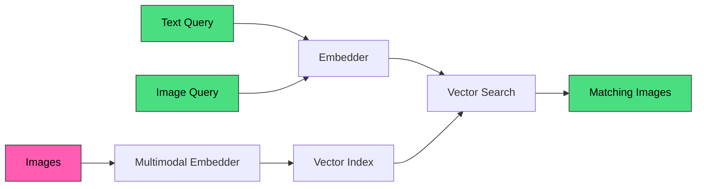

Multimodal search lets you search across different types of content—images, text, and more—using a single query. Search your image database with text descriptions, or find similar images by uploading an example.

## Key features

<CardGroup cols={2}>
  <Card title="Text-to-image search" icon="magnifying-glass">
    Find images using natural language descriptions like "sunset over mountains"
  </Card>
  <Card title="Image-to-image search" icon="images">
    Upload an image to find visually similar results
  </Card>
  <Card title="Hybrid matching" icon="circle-half-stroke">
    Combine visual similarity with metadata for precise results
  </Card>
  <Card title="Multiple providers" icon="plug">
    Use Voyage AI, OpenAI, or any multimodal embedding API
  </Card>
</CardGroup>

## How it works



1. **Indexing**: Images are converted to vector embeddings that capture visual and semantic meaning
2. **Query**: Text descriptions or images are converted to embeddings in the same vector space
3. **Search**: Find images with similar embeddings to the query

## Quick example

### Configure a multimodal embedder

```bash
curl -X PATCH "${MEILISEARCH_URL}/indexes/images/settings" \
  -H "Authorization: Bearer ${MEILISEARCH_API_KEY}" \
  -H 'Content-Type: application/json' \
  --data-binary '{
    "embedders": {
      "multimodal": {
        "source": "rest",
        "url": "https://api.voyageai.com/v1/multimodal-embeddings",
        "apiKey": "VOYAGE_API_KEY",
        "indexingFragments": {
          "image": {
            "value": {
              "content": [{"type": "image_url", "image_url": "{{doc.image_url}}"}]
            }
          }
        },
        "searchFragments": {
          "text": {
            "value": {
              "content": [{"type": "text", "text": "{{q}}"}]
            }
          }
        }
      }
    }
  }'
```

### Search with text

```bash
curl -X POST "${MEILISEARCH_URL}/indexes/images/search" \
  -H "Authorization: Bearer ${MEILISEARCH_API_KEY}" \
  -H 'Content-Type: application/json' \
  --data-binary '{
    "q": "a mountain sunset with snow",
    "hybrid": {"embedder": "multimodal"}
  }'
```

## Use cases

<CardGroup cols={2}>
  <Card title="E-commerce" icon="cart-shopping">
    Let customers search products by describing what they want or uploading inspiration images
  </Card>
  <Card title="Media libraries" icon="photo-film">
    Find images in large archives using natural language descriptions
  </Card>
  <Card title="Content moderation" icon="shield">
    Find similar images across your platform
  </Card>
  <Card title="Design systems" icon="palette">
    Search design assets by visual similarity or description
  </Card>
</CardGroup>

## Implementation approaches

| Approach | Best for | Complexity |
|----------|----------|------------|
| [Multimodal embeddings](/products/multimodal_search/image_search_with_multimodal_embeddings) | Full-featured text-to-image and image-to-image search | Medium |
| [User-provided embeddings](/products/multimodal_search/image_search_with_user_provided_embeddings) | Custom embedding pipelines, self-hosted models | Higher |

## Prerequisites

<Note>
Multimodal search is an experimental feature. Enable it in your Meilisearch Cloud project settings or via the API.
</Note>

- Access to a multimodal embedding provider (Voyage AI, OpenAI vision, etc.)
- Images accessible via URL or base64 encoding
- Experimental multimodal feature enabled

## Next steps

<CardGroup cols={2}>
  <Card title="Get started with multimodal" icon="rocket" href="/products/multimodal_search/image_search_with_multimodal_embeddings">
    Set up text-to-image search step by step
  </Card>
  <Card title="User-provided embeddings" icon="code" href="/products/multimodal_search/image_search_with_user_provided_embeddings">
    Bring your own embedding pipeline
  </Card>
  <Card title="Hybrid Search" icon="brain" href="/products/hybrid_search/overview">
    Learn about text-based semantic search
  </Card>
  <Card title="Embedder providers" icon="plug" href="/guides/ai_embedders/providers/voyage">
    Configure Voyage AI for multimodal
  </Card>
</CardGroup>
