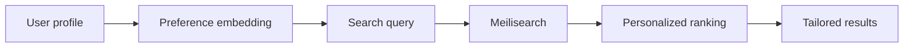

Search personalization uses AI to tailor results to individual users based on their preferences, behavior, and context. Instead of everyone seeing the same results, each user gets results optimized for them.

<Note>
Personalization is an experimental feature. It requires a Cohere API key and must be enabled via configuration.
</Note>

## Key features

<CardGroup cols={2}>
  <Card title="User preferences" icon="user-gear" href="/products/personalization/search_personalization">
    Boost results matching user interests and past behavior.
  </Card>
  <Card title="Real-time adaptation" icon="bolt">
    Results adapt as user preferences change.
  </Card>
  <Card title="Privacy-first" icon="shield-halved">
    User data stays in your application, only preferences are used.
  </Card>
  <Card title="Easy integration" icon="plug">
    Add personalization with a single search parameter.
  </Card>
</CardGroup>

## How it works



1. **Define user preferences** as a text description
2. **Include preferences** in search requests
3. **Meilisearch boosts** results matching those preferences
4. **Users see** results tailored to their interests

## Quick start

### 1. Enable personalization

Set your Cohere API key when starting Meilisearch:

```bash
export MEILI_EXPERIMENTAL_PERSONALIZATION_API_KEY="your-cohere-api-key"
./meilisearch
```

Or in Meilisearch Cloud, contact support to enable the feature.

### 2. Search with personalization

Include user preferences in your search:

```bash
curl -X POST "${MEILISEARCH_URL}/indexes/products/search" \
  -H "Authorization: Bearer ${MEILISEARCH_API_KEY}" \
  -H 'Content-Type: application/json' \
  --data-binary '{
    "q": "headphones",
    "rankingScoreThreshold": 0.5,
    "locales": ["en"],
    "personalization": {
      "embedder": "default",
      "query": "I prefer premium brands, noise cancellation, and comfortable over-ear designs"
    }
  }'
```

### 3. Results are personalized

A user who prefers premium brands sees Sony and Bose first. A budget-conscious user sees affordable options first.

## Building user preference strings

The `personalization.query` is a natural language description of what the user prefers:

### E-commerce examples

```json
{
  "personalization": {
    "query": "Prefers organic products, vegetarian options, and sustainable packaging"
  }
}
```

```json
{
  "personalization": {
    "query": "Budget-conscious, values durability over brand names, interested in DIY and home improvement"
  }
}
```

### Content examples

```json
{
  "personalization": {
    "query": "Interested in technology news, AI developments, and startup culture"
  }
}
```

```json
{
  "personalization": {
    "query": "Enjoys cooking content, Mediterranean cuisine, quick weeknight meals"
  }
}
```

## Building preference profiles

You can build preference strings from:

### Explicit preferences

User-selected interests:

```javascript
const preferences = user.interests.join(', ');
// "technology, gaming, music production"
```

### Implicit behavior

Purchase/view history:

```javascript
const recentCategories = user.recentPurchases
  .map(p => p.category)
  .slice(0, 5)
  .join(', ');
// "electronics, headphones, audio equipment"
```

### Combined approach

```javascript
const preferenceQuery = `
  Interested in: ${user.interests.join(', ')}.
  Recently viewed: ${user.recentViews.map(v => v.category).join(', ')}.
  Preferred brands: ${user.favoriteBrands.join(', ')}.
  Budget: ${user.pricePreference}.
`;
```

## Use cases

<CardGroup cols={2}>
  <Card title="E-commerce" icon="cart-shopping">
    Show products matching user's style and budget
  </Card>
  <Card title="Content platforms" icon="newspaper">
    Surface articles matching user interests
  </Card>
  <Card title="Job boards" icon="briefcase">
    Prioritize jobs matching skills and preferences
  </Card>
  <Card title="Learning platforms" icon="graduation-cap">
    Recommend courses based on learning goals
  </Card>
</CardGroup>

## Best practices

### Keep preferences concise

```json
{
  "personalization": {
    "query": "Premium brands, wireless, noise-cancelling"
  }
}
```

Not:
```json
{
  "personalization": {
    "query": "This user has been shopping on our platform for 3 years and has purchased 47 items including..."
  }
}
```

### Update preferences regularly

Refresh preference strings based on recent activity:

```javascript
async function getPreferences(userId) {
  const user = await getUser(userId);
  const recentActivity = await getRecentActivity(userId, 30); // Last 30 days

  return buildPreferenceString(user.profile, recentActivity);
}
```

### Combine with filters

Personalization works alongside filters:

```json
{
  "q": "shoes",
  "filter": "category = 'running' AND price < 150",
  "personalization": {
    "query": "Prefers lightweight shoes, neutral colors, minimalist design"
  }
}
```

### Test with and without

Compare results to ensure personalization improves relevancy:

```javascript
// A/B test personalization effectiveness
const withPersonalization = await search(query, { personalization });
const withoutPersonalization = await search(query, {});
```

## Privacy considerations

- User preferences stay in your application
- Only the preference string is sent to Meilisearch
- No user identifiers are stored
- You control what information is included

## Next steps

<CardGroup cols={2}>
  <Card title="Configure personalization" icon="gear" href="/products/personalization/search_personalization">
    Detailed setup guide
  </Card>
  <Card title="Make personalized queries" icon="magnifying-glass" href="/products/personalization/making_personalized_search_queries">
    Query examples and patterns
  </Card>
</CardGroup>
