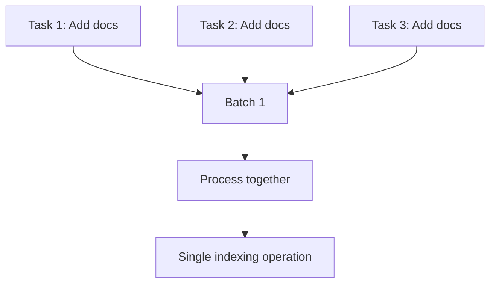

Batches are the primary unit of work in Meilisearch. When you perform operations like adding documents or updating settings, Meilisearch groups them into batches for efficient processing.

<Note>
The Meilisearch Cloud dashboard provides the best experience for monitoring and debugging batches. While you can use the API, the Cloud UI offers richer visualizations and insights.
</Note>

## Why batches matter

Understanding batches helps you:

- **Monitor indexing progress**: See real-time progress of document indexing
- **Debug performance issues**: Identify which operations take the longest
- **Track storage changes**: See how indexing affects disk usage
- **Understand failures**: Get detailed error information when things go wrong

## Batches vs tasks

| Concept | Description |
|---------|-------------|
| **Task** | A single operation (add documents, update settings, etc.) |
| **Batch** | A group of tasks processed together for efficiency |

Meilisearch automatically groups compatible tasks into batches. For example, multiple document additions to the same index may be combined into a single batch.



## Viewing batches in Meilisearch Cloud

The Cloud dashboard shows all batches for your project with their status and key metrics.

### Batch list

Navigate to your project and click "Tasks" to see the batch list:

<Frame>
  
</Frame>

The list shows:
- Batch UID and status
- Number of tasks in the batch
- Duration
- When it started and finished

### Batch detail view

Click a batch to see detailed information:

<Frame>
  
</Frame>

## Batch object structure

When querying the API, a batch object contains:

```json
{
  "uid": 42,
  "progress": null,
  "details": {
    "receivedDocuments": 10000,
    "indexedDocuments": 10000
  },
  "stats": {
    "totalNbTasks": 3,
    "status": { "succeeded": 3 },
    "types": { "documentAdditionOrUpdate": 3 },
    "indexUids": { "products": 3 },
    "progressTrace": { ... },
    "internalDatabaseSizes": { ... },
    "writeChannelCongestion": { ... }
  },
  "duration": "PT2.345S",
  "startedAt": "2024-01-15T10:00:00Z",
  "finishedAt": "2024-01-15T10:00:02.345Z",
  "batchStrategy": "automatic"
}
```

### Key fields

| Field | Description |
|-------|-------------|
| `uid` | Unique batch identifier |
| `progress` | Real-time progress while processing (`null` when complete) |
| `details` | Summary of documents received/indexed |
| `stats` | Detailed statistics including progressTrace and storage changes |
| `duration` | Total processing time |
| `batchStrategy` | How Meilisearch grouped the tasks |

## Batch statuses

Batches progress through these statuses:

| Status | Description |
|--------|-------------|
| `enqueued` | Batch is waiting to be processed |
| `processing` | Batch is currently being processed |
| `succeeded` | All tasks in the batch completed successfully |
| `failed` | One or more tasks in the batch failed |
| `canceled` | Batch was canceled before completion |

## Real-time progress

While a batch is processing, the `progress` field shows real-time updates:

```json
{
  "progress": {
    "steps": [
      {
        "currentStep": "extracting words",
        "finished": 5000,
        "total": 10000
      }
    ],
    "percentage": 50.0
  }
}
```

The Cloud dashboard displays this as a progress bar with the current operation:

<Frame>
  
</Frame>

## Querying batches via API

### List all batches

```bash
curl "${MEILISEARCH_URL}/batches" \
  -H "Authorization: Bearer ${MEILISEARCH_API_KEY}"
```

### Get a specific batch

```bash
curl "${MEILISEARCH_URL}/batches/42" \
  -H "Authorization: Bearer ${MEILISEARCH_API_KEY}"
```

### Filter batches

Filter by status, index, or other criteria:

```bash
curl "${MEILISEARCH_URL}/batches?statuses=failed&indexUids=products" \
  -H "Authorization: Bearer ${MEILISEARCH_API_KEY}"
```

## Next steps

<CardGroup cols={2}>
  <Card title="Debug batch performance" icon="bug" href="/products/platform/batch_debugging">
    Use progressTrace and storage metrics to identify bottlenecks
  </Card>
  <Card title="Batches API reference" icon="code" href="/reference/api/batches/overview">
    Full API documentation
  </Card>
</CardGroup>
