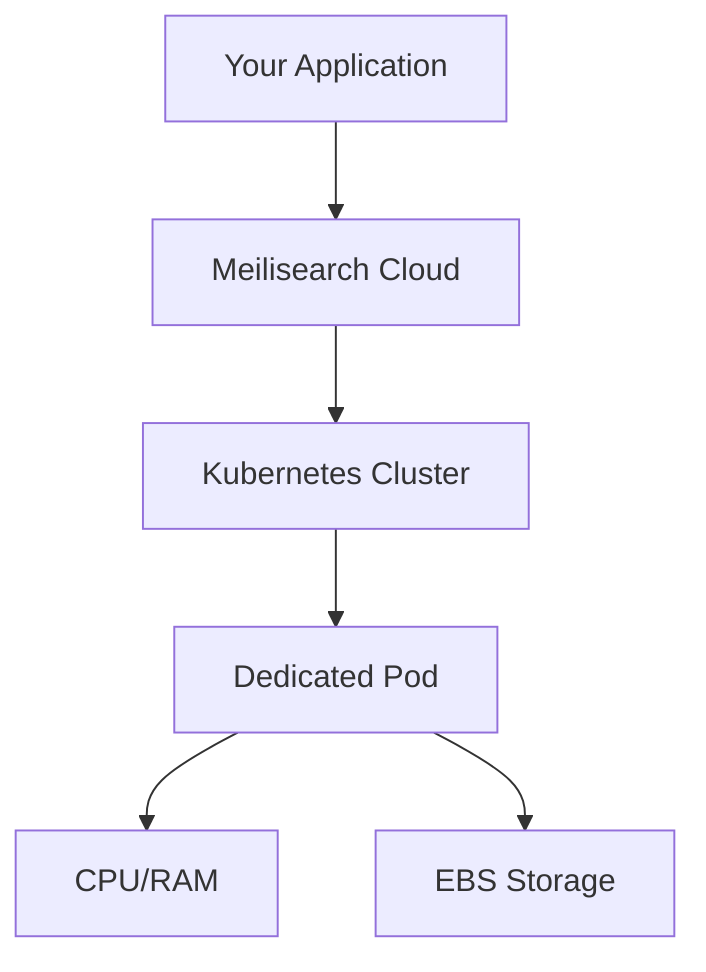

Meilisearch Cloud provides fully managed search infrastructure optimized for low latency and high scalability. Every project runs on dedicated resources—your data is never shared with other customers.

## Architecture overview

Meilisearch Cloud runs on AWS infrastructure with enterprise-grade reliability:

- **Dedicated compute**: Each project gets its own CPU and RAM allocation
- **Kubernetes orchestration**: Automatic scaling, load balancing, and failover
- **EBS storage**: Persistent block storage with automatic scaling
- **No multi-tenancy**: Your resources are isolated from other customers

## Available regions

Choose the region closest to your users for the lowest latency:

| Region | Location | AWS Region Code |
|--------|----------|-----------------|
| US East 1 | N. Virginia, USA | `us-east-1` |
| US East 2 | Ohio, USA | `us-east-2` |
| EU West 1 | Dublin, Ireland | `eu-west-1` |
| EU Central 1 | Frankfurt, Germany | `eu-central-1` |
| AP Northeast 1 | Tokyo, Japan | `ap-northeast-1` |
| AP Southeast 1 | Singapore | `ap-southeast-1` |

<Frame>
  
</Frame>

<Note>
Region cannot be changed after project creation. Choose based on where most of your users are located.
</Note>

## Dedicated resources

Every Meilisearch Cloud project runs on dedicated infrastructure:

### Compute (CPU & RAM)

- **Dedicated allocation**: Your project's CPU and RAM are not shared
- **Consistent performance**: No "noisy neighbor" issues
- **Scalable**: Upgrade or downgrade based on your needs

### Storage (EBS)

- **Automatically scaled**: Disk grows as your data grows
- **High-performance SSDs**: Optimized for search workloads
- **IOPS and bandwidth**: Scale with instance size

<Tip>
Disk IOPS and bandwidth are tied to instance size. If you experience write congestion, upgrading to a larger instance may help even if you don't need more CPU/RAM.
</Tip>

### Networking

- **Private networking**: Secure communication between components
- **Load balancing**: Traffic distributed for reliability
- **DDoS protection**: AWS Shield protects against attacks

## High availability and failover

Meilisearch Cloud is designed for reliability:

### Automatic failover

If a node becomes unhealthy, Kubernetes automatically:
1. Detects the failure
2. Provisions a new node
3. Attaches the EBS storage
4. Restores service

Because data is stored on EBS (not local disk), failover typically happens with **minimal to no downtime**.

### Zero-downtime upgrades

Meilisearch supports [dumpless upgrades](/products/platform/upgrades_and_backups) that:
- Upgrade in seconds, not hours
- Only recompute what changed between versions
- Keep your project available during the process

## Security and compliance

### SOC 2 Type 2 certified

Meilisearch Cloud has achieved SOC 2 Type 2 certification, demonstrating:
- Rigorous security controls
- Regular third-party audits
- Enterprise-grade data protection

### Network security

- **Encryption in transit**: All API traffic uses TLS
- **Encryption at rest**: Data encrypted on EBS volumes
- **Private endpoints**: Available for enterprise customers

### Access control

- **API key authentication**: Fine-grained access control
- **Tenant tokens**: User-level data isolation
- **SSO/SAML**: Enterprise single sign-on (enterprise tier)
- **SCIM**: Automated user provisioning (enterprise tier)

## Automatic backups

Meilisearch Cloud automatically backs up your data:

| Plan | Backup frequency | Retention |
|------|------------------|-----------|
| Standard | Weekly | Last 2 backups |
| Enterprise | Customizable | Customizable |

Backups enable:
- Disaster recovery
- Point-in-time restoration
- Data migration

[Learn more about backups](/products/platform/upgrades_and_backups)

## Monitoring and observability

### Cloud dashboard

The Meilisearch Cloud dashboard provides:
- Real-time metrics (CPU, RAM, disk usage)
- Batch and task monitoring
- Search analytics
- Health status

<Frame>
  
</Frame>

### Metrics available

| Metric | Description |
|--------|-------------|
| CPU usage | Current and historical CPU utilization |
| Memory usage | RAM consumption |
| Disk usage | Storage consumption and growth |
| Search latency | Response time percentiles |
| Indexing throughput | Documents indexed per second |

## Choosing the right setup

### For prototypes and MVPs

- Start with **usage-based** pricing
- Choose the region closest to your development team
- Upgrade as traffic grows

### For production workloads

- Consider **resource-based** pricing for predictable costs
- Choose the region closest to your users
- Size based on dataset and query volume

### For high-traffic applications

- Use **resource-based** pricing with dedicated resources
- Consider multiple projects for geographic distribution
- Contact sales for enterprise features

## Next steps

<CardGroup cols={2}>
  <Card title="Pricing and plans" icon="tags" href="/products/platform/pricing_and_plans">
    Compare usage-based and resource-based pricing
  </Card>
  <Card title="Upgrades and backups" icon="arrows-rotate" href="/products/platform/upgrades_and_backups">
    Learn about zero-downtime upgrades
  </Card>
</CardGroup>
