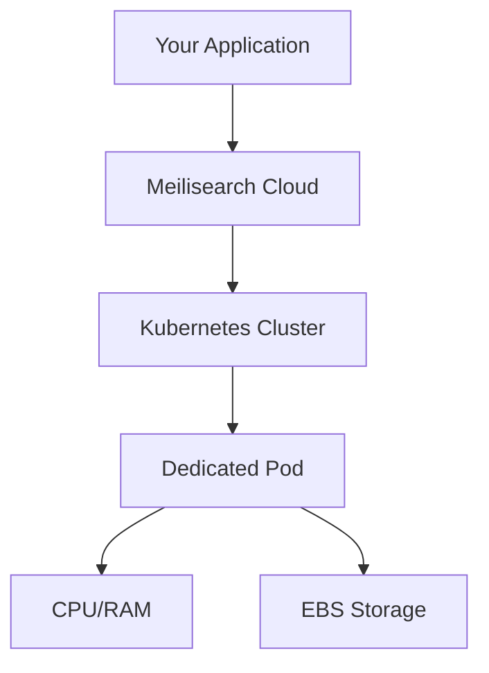

Meilisearch Cloud provides fully managed search infrastructure optimized for low latency and high reliability. Every project runs on dedicated resources with automatic backups and zero-downtime upgrades.

## Architecture overview

Meilisearch Cloud runs on AWS infrastructure with enterprise-grade reliability:

- **Dedicated compute**: Each project gets its own CPU and RAM allocation
- **Kubernetes orchestration**: Automatic scaling, load balancing, and failover
- **EBS storage**: Persistent block storage with automatic scaling
- **No multi-tenancy**: Your resources are isolated from other customers



## Available regions

Choose the region closest to your users for the lowest latency:

| Region | Location | AWS Region Code |
|--------|----------|-----------------|
| US East 1 | N. Virginia, USA | `us-east-1` |
| US East 2 | Ohio, USA | `us-east-2` |
| EU West 1 | Dublin, Ireland | `eu-west-1` |
| EU Central 1 | Frankfurt, Germany | `eu-central-1` |
| AP Northeast 1 | Tokyo, Japan | `ap-northeast-1` |
| AP Southeast 1 | Singapore | `ap-southeast-1` |

<Frame>
  
</Frame>

<Note>
Region cannot be changed after project creation. Choose based on where most of your users are located.
</Note>

## Dedicated resources

Every Meilisearch Cloud project runs on dedicated infrastructure:

### Compute (CPU & RAM)

- **Dedicated allocation**: Your project's CPU and RAM are not shared
- **Consistent performance**: No "noisy neighbor" issues
- **Scalable**: Upgrade or downgrade based on your needs

### Storage (EBS)

- **Automatically scaled**: Disk grows as your data grows
- **High-performance SSDs**: Optimized for search workloads
- **IOPS and bandwidth**: Scale with instance size

<Tip>
Disk IOPS and bandwidth are tied to instance size. If you experience write congestion, upgrading to a larger instance may help even if you don't need more CPU/RAM.
</Tip>

### Networking

- **Private networking**: Secure communication between components
- **Load balancing**: Traffic distributed for reliability
- **DDoS protection**: AWS Shield protects against attacks

## High availability and failover

Meilisearch Cloud is designed for reliability:

### Automatic failover

If a node becomes unhealthy, Kubernetes automatically:
1. Detects the failure
2. Provisions a new node
3. Attaches the EBS storage
4. Restores service

Because data is stored on EBS (not local disk), failover typically happens with **minimal to no downtime**.

## Zero-downtime upgrades

Meilisearch Cloud supports one-click upgrades that keep your project available throughout the process.

### How upgrades work

1. Click **Upgrade** in your project settings
2. Meilisearch prepares the new version
3. Your project switches to the new version with minimal interruption
4. The upgrade completes in seconds to minutes

<Frame>
  
</Frame>

### Dumpless upgrades

Traditional upgrades require exporting all data (creating a dump) and re-importing it into the new version. This is slow for large datasets.

**Dumpless upgrades** are a Meilisearch innovation that:
- Only recompute what changed between versions
- Complete in seconds, not hours
- Work even with millions of documents
- Keep your project available during the process

| Upgrade type | Time for 10M documents | Downtime |
|--------------|------------------------|----------|
| Traditional (with dump) | Hours | Significant |
| Dumpless | Seconds to minutes | Minimal to none |

### When to upgrade

- **Security updates**: Apply promptly for security patches
- **New features**: Upgrade when you need new capabilities
- **Performance improvements**: Benefit from engine optimizations

<Tip>
Enable automatic upgrades in project settings to stay current automatically, or manually upgrade when convenient for your deployment schedule.
</Tip>

### Upgrade notifications

Meilisearch Cloud notifies you when new versions are available:
- Email notifications
- Dashboard banners
- Release notes with changes

## Automatic backups

Meilisearch Cloud automatically backs up your data to protect against data loss.

### How backups work

1. Meilisearch creates periodic snapshots of your data
2. Snapshots are stored securely in the same region
3. Backups can be restored by contacting support

### Backup schedule

| Plan | Frequency | Retention |
|------|-----------|-----------|
| Standard | Weekly | Last 2 backups |
| Enterprise | Customizable | Customizable |

<Note>
Enterprise customers can configure backup frequency (daily, hourly) and retention period based on their requirements.
</Note>

### What's backed up

Backups include:
- All indexed documents
- Index settings and configuration
- API keys and permissions

### Restoring from backup

To restore from a backup:
1. Contact Meilisearch support
2. Specify the backup date/time to restore
3. Choose whether to restore to the same project or a new one

<Warning>
Restoring from backup replaces current data. Consider creating a new project for restoration if you need to preserve current state.
</Warning>

## Disaster recovery

Meilisearch Cloud provides multiple layers of protection:

| Layer | Protection against |
|-------|-------------------|
| **EBS storage** | Disk failures |
| **Kubernetes failover** | Node failures |
| **Automatic backups** | Data corruption, accidental deletion |
| **Regional redundancy** | Availability zone failures |

### Recovery time objectives

| Scenario | Typical recovery time |
|----------|----------------------|
| Node failure | Minutes (automatic) |
| Restore from backup | Hours (contact support) |

## Security and compliance

### SOC 2 Type 2 certified

Meilisearch Cloud has achieved SOC 2 Type 2 certification, demonstrating:
- Rigorous security controls
- Regular third-party audits
- Enterprise-grade data protection

### Network security

- **Encryption in transit**: All API traffic uses TLS
- **Encryption at rest**: Data encrypted on EBS volumes
- **Private endpoints**: Available for enterprise customers

## Version management

### Checking current version

View your project's Meilisearch version in the dashboard:

<Frame>
  
</Frame>

### Version compatibility

When upgrading:
- Data format is preserved across versions
- API compatibility is maintained within major versions
- Breaking changes are documented in release notes

### Rollback

If issues occur after upgrade:
1. Contact Meilisearch support
2. Describe the issue
3. Support can assist with rollback if needed

<Note>
Dumpless upgrades make rollbacks rare since upgrades are fast and low-risk.
</Note>

## Monitoring and observability

### Cloud dashboard

The Meilisearch Cloud dashboard provides:
- Real-time metrics (CPU, RAM, disk usage)
- Batch and task monitoring
- Search analytics
- Health status

<Frame>
  
</Frame>

### Metrics available

| Metric | Description |
|--------|-------------|
| CPU usage | Current and historical CPU utilization |
| Memory usage | RAM consumption |
| Disk usage | Storage consumption and growth |
| Search latency | Response time percentiles |
| Indexing throughput | Documents indexed per second |

## Manual snapshots (Self-hosted)

For self-hosted Meilisearch, you can create manual snapshots:

```bash
curl -X POST "${MEILISEARCH_URL}/snapshots" \
  -H "Authorization: Bearer ${MEILISEARCH_API_KEY}"
```

This creates a point-in-time snapshot that can be used for:
- Backup before risky operations
- Migration to new infrastructure
- Disaster recovery

<Note>
Manual snapshots are primarily for self-hosted installations. Meilisearch Cloud handles backups automatically.
</Note>

## Next steps

<CardGroup cols={2}>
  <Card title="Billing and pricing" icon="tags" href="/products/platform/billing">
    Compare pricing models and manage billing
  </Card>
  <Card title="Teams" icon="users" href="/products/platform/teams">
    Manage team collaboration
  </Card>
</CardGroup>
