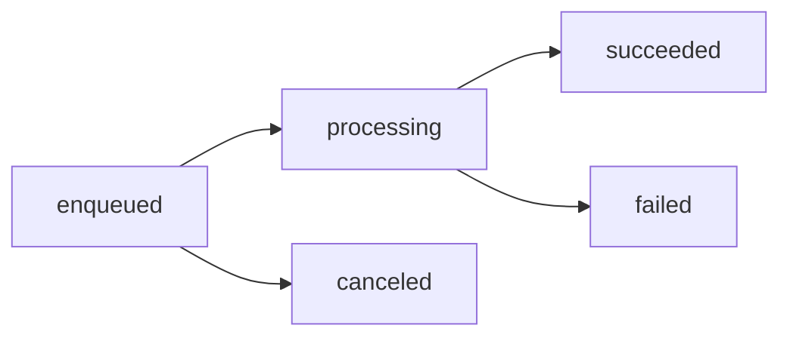

The Meilisearch platform provides everything you need to run search in production: team collaboration, security and access control, asynchronous task management, and operational monitoring.

## Key capabilities

<CardGroup cols={2}>
  <Card title="Teams & collaboration" icon="users" href="/products/platform/teams">
    Invite team members, manage roles, and collaborate on projects.
  </Card>
  <Card title="Security & API keys" icon="key" href="/products/platform/basic_security">
    Protect your data with API keys, tenant tokens, and access control.
  </Card>
  <Card title="Tasks & async operations" icon="list-check" href="/products/platform/working_with_tasks">
    Monitor indexing tasks and asynchronous operations.
  </Card>
  <Card title="Webhooks" icon="webhook" href="/products/platform/task_webhook">
    Get notified when tasks complete for real-time integrations.
  </Card>
</CardGroup>

## Teams & collaboration

<Note>
Team management is a Meilisearch Cloud feature.
</Note>

### Invite team members

Add developers, content managers, and stakeholders to your projects with appropriate access levels.

### Role-based access

| Role | Capabilities |
|------|--------------|
| **Owner** | Full access, billing, delete project |
| **Admin** | Manage settings, keys, team members |
| **Developer** | API access, view settings |
| **Viewer** | Read-only dashboard access |

[Learn more about teams →](/products/platform/teams)

## Security & API keys

Meilisearch uses API keys to authenticate requests and control access.

### Key types

| Key type | Purpose | Capabilities |
|----------|---------|--------------|
| **Master key** | Admin access (self-hosted) | Everything |
| **Admin API key** | Server-side operations | Create indexes, manage settings |
| **Search API key** | Client-side search | Search only, safe for browsers |

### Tenant tokens

For multi-tenant applications, generate scoped tokens that restrict access to specific data:

```javascript
const token = client.generateTenantToken(
  searchKey.uid,
  { filter: `tenant_id = ${tenantId}` },
  { expiresAt: new Date(Date.now() + 3600000) }
);
```

[Learn more about security →](/products/platform/basic_security)

## Tasks & async operations

Most Meilisearch operations are asynchronous. When you add documents or update settings, Meilisearch returns a task ID immediately while processing happens in the background.

### Task lifecycle



### Monitor tasks

```bash
# Get task status
curl "${MEILISEARCH_URL}/tasks/42" \
  -H "Authorization: Bearer ${MEILISEARCH_API_KEY}"
```

```json
{
  "uid": 42,
  "status": "succeeded",
  "type": "documentAdditionOrUpdate",
  "duration": "PT0.125S",
  "enqueuedAt": "2024-01-15T10:00:00Z",
  "startedAt": "2024-01-15T10:00:00Z",
  "finishedAt": "2024-01-15T10:00:00Z"
}
```

### Filter and paginate tasks

```bash
# Get failed tasks for an index
curl "${MEILISEARCH_URL}/tasks?indexUids=products&statuses=failed" \
  -H "Authorization: Bearer ${MEILISEARCH_API_KEY}"
```

[Learn more about tasks →](/products/platform/working_with_tasks)

## Webhooks

Get notified when tasks complete via HTTP webhooks:

### Configure webhooks (Cloud)

Use the webhooks API:

```bash
curl -X POST "${MEILISEARCH_URL}/webhooks" \
  -H "Authorization: Bearer ${MEILISEARCH_API_KEY}" \
  -H 'Content-Type: application/json' \
  --data-binary '{
    "url": "https://your-app.com/webhooks/meilisearch",
    "description": "Notify on task completion"
  }'
```

### Configure webhooks (Self-hosted)

Use launch configuration:

```bash
./meilisearch --task-webhook-url="https://your-app.com/webhooks/meilisearch"
```

[Learn more about webhooks →](/products/platform/task_webhook)

## Quick reference

### API key management

```bash
# List all keys
curl "${MEILISEARCH_URL}/keys" \
  -H "Authorization: Bearer ${MEILISEARCH_API_KEY}"

# Create a new key
curl -X POST "${MEILISEARCH_URL}/keys" \
  -H "Authorization: Bearer ${MEILISEARCH_API_KEY}" \
  -H 'Content-Type: application/json' \
  --data-binary '{
    "description": "Search key for mobile app",
    "actions": ["search"],
    "indexes": ["products"],
    "expiresAt": "2025-01-01T00:00:00Z"
  }'
```

### Task management

```bash
# List recent tasks
curl "${MEILISEARCH_URL}/tasks?limit=10" \
  -H "Authorization: Bearer ${MEILISEARCH_API_KEY}"

# Cancel pending tasks
curl -X POST "${MEILISEARCH_URL}/tasks/cancel?statuses=enqueued" \
  -H "Authorization: Bearer ${MEILISEARCH_API_KEY}"
```

## Platform sections

<CardGroup cols={2}>
  <Card title="Teams" icon="users" href="/products/platform/teams">
    Collaborate with your team
  </Card>
  <Card title="Security basics" icon="lock" href="/products/platform/basic_security">
    API keys and authentication
  </Card>
  <Card title="Tenant tokens" icon="id-badge" href="/products/platform/multitenancy_tenant_tokens">
    Multi-tenant access control
  </Card>
  <Card title="Working with tasks" icon="list-check" href="/products/platform/working_with_tasks">
    Monitor async operations
  </Card>
  <Card title="Task webhooks" icon="webhook" href="/products/platform/task_webhook">
    Get task notifications
  </Card>
  <Card title="Async operations" icon="clock" href="/products/platform/asynchronous_operations">
    Understand async behavior
  </Card>
</CardGroup>
