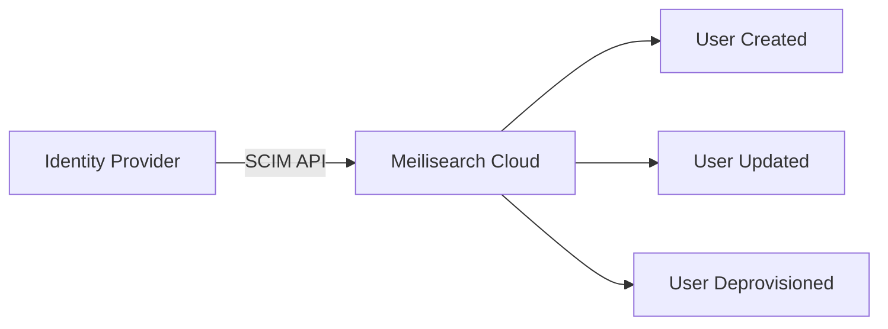

Meilisearch Cloud supports enterprise authentication features including SAML-based single sign-on (SSO) and SCIM for automated user provisioning.

<Note>
SSO and SCIM are available on enterprise plans. [Contact sales](https://www.meilisearch.com/contact) to enable these features for your organization.
</Note>

## Single sign-on (SSO)

SSO allows your team members to authenticate using your organization's identity provider (IdP) instead of creating separate Meilisearch credentials.

### Benefits

- **Centralized access control**: Manage Meilisearch access from your IdP
- **Improved security**: Enforce your organization's authentication policies
- **Better user experience**: One set of credentials for all tools
- **Automatic deprovisioning**: Users lose access when removed from IdP

### Supported identity providers

Meilisearch Cloud supports SAML 2.0 compatible identity providers, including:

- Okta
- Azure Active Directory (Microsoft Entra ID)
- Google Workspace
- OneLogin
- JumpCloud
- PingIdentity

### Setting up SSO

<Steps>
  <Step title="Contact Meilisearch">
    Reach out to your account manager or [contact sales](https://www.meilisearch.com/contact) to enable SSO for your organization.
  </Step>
  <Step title="Provide IdP information">
    Share your identity provider details:
    - IdP metadata URL or XML
    - Entity ID
    - SSO URL
    - Certificate
  </Step>
  <Step title="Configure your IdP">
    Add Meilisearch as a SAML application in your IdP using the configuration provided by Meilisearch.
  </Step>
  <Step title="Test the connection">
    Verify SSO works by signing in through your IdP.
  </Step>
  <Step title="Roll out to your team">
    Invite team members and they'll authenticate through your IdP.
  </Step>
</Steps>

### SSO configuration details

When configuring your IdP, you'll need:

| Setting | Value |
|---------|-------|
| ACS URL | Provided by Meilisearch during setup |
| Entity ID | Provided by Meilisearch during setup |
| Name ID format | Email address |
| Attributes | email (required), firstName, lastName (optional) |

### SSO behavior

Once SSO is enabled:

- Users sign in through your IdP
- Password-based login is disabled for SSO users
- Organization owners can still use password login as a backup
- Session length follows your IdP's policies

## SCIM provisioning

SCIM (System for Cross-domain Identity Management) automates user provisioning and deprovisioning between your IdP and Meilisearch Cloud.

### Benefits

- **Automated user creation**: Users are created when added to your IdP
- **Automatic deprovisioning**: Users are removed when deleted from IdP
- **Group sync**: Map IdP groups to Meilisearch teams
- **Reduced admin work**: No manual user management

### How SCIM works

1. You add a user to the Meilisearch group in your IdP
2. Your IdP sends a SCIM request to Meilisearch
3. Meilisearch creates the user account
4. User can sign in via SSO

When you remove the user from your IdP, Meilisearch automatically revokes their access.

### Setting up SCIM

<Steps>
  <Step title="Enable SCIM">
    Contact your account manager to enable SCIM for your organization.
  </Step>
  <Step title="Get SCIM credentials">
    Meilisearch provides:
    - SCIM endpoint URL
    - Bearer token for authentication
  </Step>
  <Step title="Configure your IdP">
    Add Meilisearch as a SCIM application using the endpoint and token.
  </Step>
  <Step title="Map attributes">
    Configure attribute mapping between your IdP and Meilisearch.
  </Step>
  <Step title="Enable provisioning">
    Turn on automatic provisioning in your IdP.
  </Step>
</Steps>

### Supported SCIM operations

| Operation | Supported |
|-----------|-----------|
| Create user | ✅ |
| Update user | ✅ |
| Deactivate user | ✅ |
| Delete user | ✅ |
| Create group | ✅ |
| Update group membership | ✅ |

### Attribute mapping

| SCIM Attribute | Meilisearch Field |
|----------------|-------------------|
| `userName` | Email address |
| `name.givenName` | First name |
| `name.familyName` | Last name |
| `active` | Account status |

## Combining SSO and SCIM

For the best experience, use both SSO and SCIM together:

1. **SCIM** handles user lifecycle (create, update, delete)
2. **SSO** handles authentication (sign-in)

This combination provides:
- Zero manual user management
- Automatic access revocation
- Compliance with security policies
- Audit trail through your IdP

## Security considerations

### For SSO

- Use strong authentication policies in your IdP
- Enable MFA for additional security
- Regularly review user access
- Monitor sign-in logs in your IdP

### For SCIM

- Store SCIM tokens securely
- Use HTTPS for all SCIM requests
- Monitor provisioning logs for errors
- Regularly audit provisioned users

## Troubleshooting

### SSO issues

| Issue | Solution |
|-------|----------|
| Sign-in fails | Verify IdP configuration and certificate validity |
| User not created | Check SAML assertions include required attributes |
| Wrong permissions | Verify group mapping configuration |

### SCIM issues

| Issue | Solution |
|-------|----------|
| User not provisioned | Check SCIM token validity and endpoint URL |
| Attributes not synced | Verify attribute mapping in IdP |
| Deprovisioning fails | Confirm user exists in Meilisearch |

## Next steps

<CardGroup cols={2}>
  <Card title="Teams and organizations" icon="users" href="/products/platform/teams">
    Learn about team structure and roles
  </Card>
  <Card title="API key security" icon="key" href="/products/platform/api_key_permissions">
    Manage API access and permissions
  </Card>
</CardGroup>
