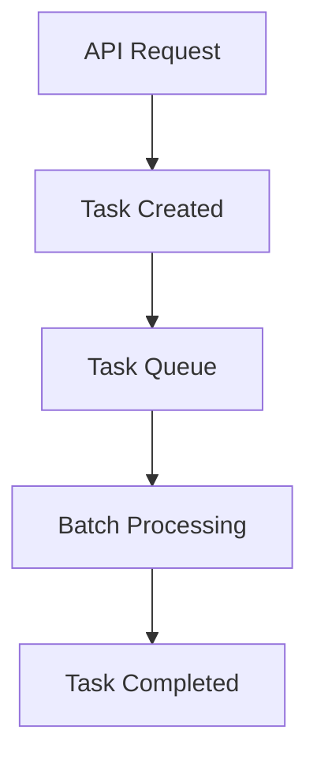
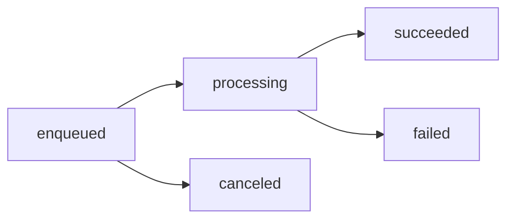

import CodeSamplesAddMoviesJson1 from '/snippets/samples/code_samples_add_movies_json_1.mdx';
import CodeSamplesGetTask1 from '/snippets/samples/code_samples_get_task_1.mdx';
import CodeSamplesAsyncGuideFilterByStatuses1 from '/snippets/samples/code_samples_async_guide_filter_by_statuses_1.mdx';
import CodeSamplesAsyncGuideFilterByStatuses2 from '/snippets/samples/code_samples_async_guide_filter_by_statuses_2.mdx';
import CodeSamplesAsyncGuideMultipleFilters1 from '/snippets/samples/code_samples_async_guide_multiple_filters_1.mdx';
import CodeSamplesGetAllTasksPaginating1 from '/snippets/samples/code_samples_get_all_tasks_paginating_1.mdx';
import CodeSamplesGetAllTasksPaginating2 from '/snippets/samples/code_samples_get_all_tasks_paginating_2.mdx';

Many Meilisearch operations are processed **asynchronously**. When you add documents or update settings, Meilisearch places the request in a queue and processes it in the background. This allows resource-intensive operations to happen without impacting search performance.

<Note>
Tasks are individual operations, but Meilisearch groups tasks into [batches](/products/platform/batches) for efficient processing. For monitoring indexing progress and debugging performance, the batch view in Meilisearch Cloud is the best starting point.
</Note>

## Tasks and batches

Understanding the relationship between tasks and batches:

| Concept | Description |
|---------|-------------|
| **Task** | A single operation (add documents, update settings, etc.) |
| **Batch** | A group of tasks processed together for efficiency |

When you make an API request, Meilisearch creates a task. Multiple compatible tasks may be combined into a single batch for processing.



## Asynchronous operations

These operations are handled asynchronously:

- Creating, updating, swapping, or deleting indexes
- Adding, updating, or deleting documents
- Updating index settings
- Canceling or deleting tasks
- Creating dumps or snapshots

## Task lifecycle

### Task statuses

Tasks progress through these statuses:

| Status | Description |
|--------|-------------|
| `enqueued` | Task is waiting in the queue |
| `processing` | Task is currently being processed |
| `succeeded` | Task completed successfully |
| `failed` | Task failed (see error field) |
| `canceled` | Task was canceled before completion |



### Task object

When you make an asynchronous request, Meilisearch returns a summarized task object:

```json
{
  "taskUid": 0,
  "indexUid": "movies",
  "status": "enqueued",
  "type": "documentAdditionOrUpdate",
  "enqueuedAt": "2021-08-11T09:25:53.000000Z"
}
```

Use the `taskUid` to check the task's full status:

<CodeSamplesGetTask1 />

The full task object includes additional fields:

```json
{
  "uid": 4,
  "indexUid": "movies",
  "status": "succeeded",
  "type": "documentAdditionOrUpdate",
  "canceledBy": null,
  "details": {
    "receivedDocuments": 67493,
    "indexedDocuments": 67493
  },
  "error": null,
  "duration": "PT0.001192S",
  "enqueuedAt": "2022-08-04T12:28:15.159167Z",
  "startedAt": "2022-08-04T12:28:15.161996Z",
  "finishedAt": "2022-08-04T12:28:15.163188Z"
}
```

### Failed tasks

When a task fails, the `error` field contains details:

```json
{
  "uid": 1,
  "status": "failed",
  "error": {
    "message": "Document does not have a `:primaryKey` attribute.",
    "code": "missing_document_id",
    "type": "invalid_request",
    "link": "https://docs.meilisearch.com/errors#missing-document-id"
  }
}
```

## Monitoring tasks

### In Meilisearch Cloud

The Cloud dashboard provides the best task monitoring experience:

1. Navigate to your project
2. Click **Tasks** in the project menu
3. View all tasks and their batches

<Frame>
  
</Frame>

<Tip>
For performance insights, click through to the batch view where you can see operation timelines and resource usage.
</Tip>

### Via API

List all tasks:

```bash
curl "${MEILISEARCH_URL}/tasks" \
  -H "Authorization: Bearer ${MEILISEARCH_API_KEY}"
```

Get a specific task:

```bash
curl "${MEILISEARCH_URL}/tasks/42" \
  -H "Authorization: Bearer ${MEILISEARCH_API_KEY}"
```

## Filtering tasks

Filter tasks to find specific operations or troubleshoot issues.

### Filter by status

Get all failed tasks:

<CodeSamplesAsyncGuideFilterByStatuses1 />

Get both canceled and failed tasks:

<CodeSamplesAsyncGuideFilterByStatuses2 />

### Available filters

| Parameter | Description | Example |
|-----------|-------------|---------|
| `uids` | Task UIDs | `uids=1,2,3` |
| `statuses` | Task statuses | `statuses=failed,canceled` |
| `types` | Task types | `types=documentAdditionOrUpdate` |
| `indexUids` | Index names | `indexUids=products,orders` |
| `canceledBy` | Cancellation task UID | `canceledBy=5` |
| `beforeEnqueuedAt` | Enqueued before date | `beforeEnqueuedAt=2024-01-01` |
| `afterEnqueuedAt` | Enqueued after date | `afterEnqueuedAt=2024-01-01` |

### Combining filters

Use `&` to combine filters (logical AND):

<CodeSamplesAsyncGuideMultipleFilters1 />

This returns tasks that match ALL specified criteria.

<Warning>
OR operations between different filter types are not supported. You cannot query for tasks that are type `documentAddition` OR status `failed`.
</Warning>

## Paginating tasks

By default, Meilisearch returns 20 tasks per request.

### Change the limit

<CodeSamplesGetAllTasksPaginating1 />

### Navigate pages

Use `from` with the `next` value from the previous response:

<CodeSamplesGetAllTasksPaginating2 />

Response:

```json
{
  "results": [...],
  "total": 50,
  "limit": 2,
  "from": 8,
  "next": 6
}
```

When `next` is `null`, you've reached the final page.

<Tip>
Combine pagination with filters to navigate filtered task lists.
</Tip>

## Task queue

### Queue behavior

Meilisearch processes tasks in order, with some exceptions for high-priority operations.

### Priority tasks

These task types are processed first, in order:

1. `taskCancelation`
2. `upgradeDatabase`
3. `taskDeletion`
4. `indexCompaction`
5. `export`
6. `snapshotCreation`
7. `dumpCreation`

All other tasks are processed in the order they were enqueued.

### Queue limits

<Warning>
The task queue has a limit of approximately 10 GiB. If exceeded, Meilisearch returns a `no_space_left_on_device` error. Delete old tasks to free space.
</Warning>

Meilisearch stores up to 1 million tasks. When this limit is reached, the oldest 100K finished tasks are automatically deleted.

## Canceling tasks

Cancel enqueued or processing tasks:

```bash
curl -X POST "${MEILISEARCH_URL}/tasks/cancel?statuses=enqueued" \
  -H "Authorization: Bearer ${MEILISEARCH_API_KEY}"
```

Canceled tasks show status `canceled` and a non-null `canceledBy` field.

<Note>
Terminating a Meilisearch instance does not cancel tasks. Processing tasks are reset to `enqueued` and resume when the instance restarts.
</Note>

## Deleting tasks

Delete finished tasks to free queue space:

```bash
curl -X DELETE "${MEILISEARCH_URL}/tasks?statuses=succeeded,failed" \
  -H "Authorization: Bearer ${MEILISEARCH_API_KEY}"
```

Only finished tasks (`succeeded`, `failed`, `canceled`) can be deleted.

## Global tasks

Some tasks apply to the entire instance rather than a specific index:

- `dumpCreation`
- `taskCancelation`
- `taskDeletion`
- `indexSwap`
- `snapshotCreation`

These tasks show `null` for `indexUid`.

<Note>
To view global tasks in a protected instance, your API key must have access to all indexes (`"indexes": ["*"]`).
</Note>

## Next steps

<CardGroup cols={2}>
  <Card title="Understanding batches" icon="layer-group" href="/products/platform/batches">
    Learn how tasks are grouped into batches
  </Card>
  <Card title="Debug batch performance" icon="bug" href="/products/platform/batch_debugging">
    Identify and resolve indexing bottlenecks
  </Card>
  <Card title="Webhooks" icon="webhook" href="/products/platform/webhooks">
    Get notified when tasks complete
  </Card>
  <Card title="Tasks API reference" icon="code" href="/reference/api/tasks/overview">
    Full API documentation
  </Card>
</CardGroup>
