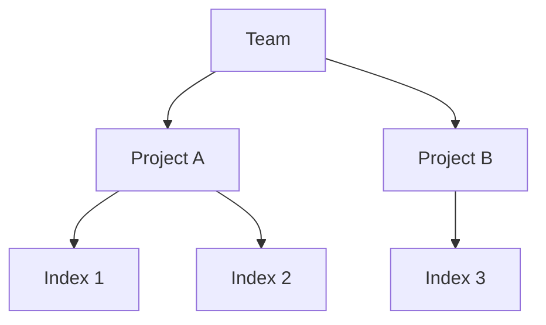
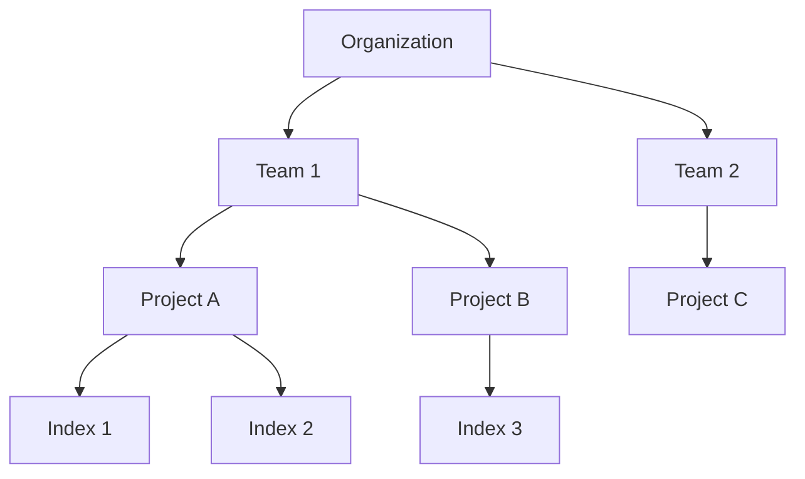

Meilisearch Cloud uses teams to organize your resources and manage collaboration. The structure differs slightly between standard and enterprise plans.

## Resource hierarchy

### Standard plans

On standard plans, **teams are the top-level entity**. Each team manages its own billing and contains projects:



| Level | Description |
|-------|-------------|
| **Team** | Top-level entity with its own billing |
| **Project** | A Meilisearch instance with dedicated resources |
| **Index** | A collection of documents within a project |

Billing, payment methods, and invoices are managed at the team level.

### Enterprise plans

Enterprise customers have access to **organizations**—a level above teams that enables centralized management:



| Level | Description |
|-------|-------------|
| **Organization** | Top-level entity for enterprise billing and features |
| **Team** | Group of users with shared access to projects |
| **Project** | A Meilisearch instance with dedicated resources |
| **Index** | A collection of documents within a project |

With organizations:
- **Billing consolidation**: All team charges roll up to the organization level
- **Centralized administration**: Manage multiple teams from one place
- **Enterprise features**: SSO, SCIM, and custom contracts apply organization-wide

<Frame>
  
</Frame>

<Note>
Organizations are an enterprise feature. Standard plan users manage billing directly at the team level.
</Note>

## Teams

Teams are groups of users who share access to a specific set of projects. When you create an account, Meilisearch Cloud automatically creates a default team.

### Why use teams

- **Separate concerns**: Different teams for different applications
- **Access control**: Limit who can access which projects
- **Collaboration**: Work together on shared projects

### Creating teams

You can create multiple teams within an organization:

1. Go to **Organization Settings** > **Teams**
2. Click **Create team**
3. Enter a team name
4. Add team members

<Tip>
There are no limits on the number of teams you can create, and no additional cost for multiple teams.
</Tip>

### Team membership

A user can belong to multiple teams within the same organization. This is useful when someone needs access to projects across different teams.

## Team roles and permissions

Each team member has a role that determines what they can do.

### Team owner

Each team has exactly one owner with full administrative control:

| Permission | Owner |
|------------|-------|
| View projects | ✅ |
| Create projects | ✅ |
| Delete projects | ✅ |
| Change billing plan | ✅ |
| Update billing info | ✅ |
| Add team members | ✅ |
| Remove team members | ✅ |
| Rename team | ✅ |
| Transfer ownership | ✅ |

### Team member

Regular team members have operational access:

| Permission | Member |
|------------|--------|
| View projects | ✅ |
| Create projects | ✅ |
| Delete projects | ✅ |
| Change billing plan | ❌ |
| Update billing info | ❌ |
| Add team members | ❌ |
| Remove team members | ❌ |
| Rename team | ❌ |
| Transfer ownership | ❌ |

### Transferring ownership

To transfer team ownership:

1. Go to **Team Settings**
2. Click **Transfer ownership**
3. Select the new owner from team members
4. Confirm the transfer

<Warning>
Ownership transfer is immediate and cannot be undone. The previous owner becomes a regular team member.
</Warning>

## Projects

Projects are individual Meilisearch instances within a team. Each project has:

- **Dedicated resources**: CPU, RAM, and storage
- **Unique URL**: Your project's API endpoint
- **API keys**: Authentication credentials
- **Indexes**: Document collections

### Project settings

Project owners can configure:

- Project name
- Meilisearch version
- Resource allocation (for resource-based plans)
- API keys

<Frame>
  
</Frame>

### Creating projects

1. Go to your team dashboard
2. Click **Create project**
3. Choose a name and region
4. Select your plan and resources
5. Click **Create**

<Note>
Region cannot be changed after project creation. Choose the region closest to your users.
</Note>

## Indexes

Indexes are collections of documents within a project. A single project can have multiple indexes.

### Index management

Indexes are managed through:
- The Meilisearch API
- The Cloud dashboard
- SDKs

Each index has its own:
- Documents
- Settings (searchable attributes, filterable attributes, etc.)
- Performance characteristics

## Common organizational patterns

### Single application

For a single application with one search use case:

```
Organization
└── Default Team
    └── Production Project
        └── products (index)
```

### Multiple environments

For development, staging, and production:

```
Organization
└── Default Team
    ├── Development Project
    │   └── products (index)
    ├── Staging Project
    │   └── products (index)
    └── Production Project
        └── products (index)
```

### Multiple applications

For organizations with multiple products:

```
Organization
├── E-commerce Team
│   └── Store Project
│       ├── products (index)
│       └── orders (index)
└── Documentation Team
    └── Docs Project
        └── articles (index)
```

### Enterprise with departments

For large organizations:

```
Organization (with SSO/SCIM)
├── Engineering Team
│   ├── API Docs Project
│   └── Internal Tools Project
├── Marketing Team
│   └── Website Search Project
└── Support Team
    └── Help Center Project
```

## Managing team members

### Inviting members

1. Go to **Team Settings** > **Members**
2. Click **Invite member**
3. Enter their email address
4. Send the invitation

The invited user receives an email to join your team.

<Frame>
  
</Frame>

### Removing members

1. Go to **Team Settings** > **Members**
2. Find the member to remove
3. Click **Remove**
4. Confirm removal

<Note>
Removing a team member revokes their access to all projects in that team. They retain access to other teams they belong to.
</Note>

## Best practices

### Team organization

- **Separate by responsibility**: Create teams based on who needs access to what
- **Limit team size**: Smaller teams are easier to manage
- **Use descriptive names**: Make it clear what each team is for

### Access control

- **Principle of least privilege**: Only add members who need access
- **Regular audits**: Periodically review team membership
- **Use SSO/SCIM**: For enterprises, automate access management

### Project organization

- **Separate environments**: Use different projects for dev/staging/prod
- **Clear naming**: Include environment and purpose in project names
- **Document structure**: Keep a record of your organization hierarchy

## Limitations

- Teams cannot be deleted once created
- Each team has exactly one owner
- Organization-level billing cannot be split by team

## Next steps

<CardGroup cols={2}>
  <Card title="SSO and SCIM" icon="key" href="/products/platform/sso_and_scim">
    Set up enterprise authentication
  </Card>
  <Card title="API keys" icon="lock" href="/products/platform/api_key_permissions">
    Manage project access with API keys
  </Card>
</CardGroup>
