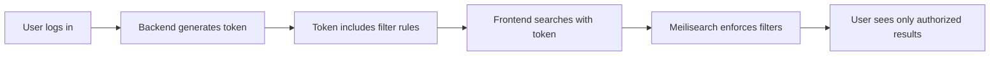

<Info>
**Live demo**: [tenant-token.meilisearch.com](https://tenant-token.meilisearch.com)
</Info>

This demo showcases Meilisearch's tenant token feature for multi-tenant applications. Each user only sees documents they're authorized to access, with filtering enforced server-side.

## Features demonstrated

- **Data isolation**: Users only see their own data
- **Server-side enforcement**: Filters cannot be bypassed client-side
- **Token-based auth**: JWT tokens with embedded search rules
- **Transparent to users**: Same search experience, different results

## Use case

Multi-tenant SaaS applications need data isolation:

- Each customer sees only their data
- Users within an organization see their team's documents
- Role-based access to different document subsets
- Security enforced at the search engine level

## How tenant tokens work



1. User authenticates with your backend
2. Backend generates a tenant token with embedded filters
3. Frontend uses this token for search requests
4. Meilisearch automatically applies the filter to all searches
5. Users cannot access unauthorized documents

## Technical highlights

| Feature | Implementation |
|---------|----------------|
| Token type | JWT (JSON Web Token) |
| Filter embedding | `searchRules` in token payload |
| Expiration | Configurable token lifetime |
| Signing | HMAC using API key |

## Example token payload

```json
{
  "searchRules": {
    "products": {
      "filter": "tenant_id = 'customer_123'"
    }
  },
  "apiKeyUid": "your-search-key-uid",
  "exp": 1699900800
}
```

## Links

<CardGroup cols={2}>
  <Card title="Try the demo" icon="globe" href="https://tenant-token.meilisearch.com">
    See tenant isolation in action
  </Card>
  <Card title="Tenant tokens guide" icon="key" href="/products/platform/multitenancy_tenant_tokens">
    Implement in your app
  </Card>
</CardGroup>

## Related resources

<CardGroup cols={2}>
  <Card title="Generate tokens" icon="code" href="/products/platform/generate_tenant_token_sdk">
    SDK token generation
  </Card>
  <Card title="Security overview" icon="shield" href="/products/platform/basic_security">
    Meilisearch security model
  </Card>
</CardGroup>
