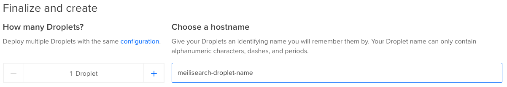

# How to deploy a MeiliSearch instance on DigitalOcean

## Create an out-of-the-box MeiliSearch

### 1. Create a new droplet

In any DigitalOcean page, when you are logged in, you will find a menu in the upper-right corner. Click on Create -> Droplets

  

### 2. Select MeiliSearch snapshot

By default DigitalOcean will show you the "distributions" tab. Select the "Marketplace" tab and search for "meili". Select it.

  

### 3. Select your plan

Select your plan, starting at $5 (click on 'See all plans for more options). Memory optimized options will give you better results for a production environment on big datasets.

  

### 4. Select a region for your droplet

Select the region where you want to deploy your droplet. Remember, the closer you are to your users or customers, the better it will be their search experience with MeiliSearch.

  

### 5. Add your ssh key

Select your SSH key in order to be able to connect to your droplet later. If you don't see your SSH key add yours to your account.  

If you need help with this, visit [this link](https://www.digitalocean.com/docs/droplets/how-to/add-ssh-keys/to-account/)

You can also set a password for `root` user if you prefer this authentication method.

  

### 6. Choose your droplet name and tags

Here you can select the name that will be visible everywhere in your DigitalOcean account. Choose wisely!

  

Tags are a very good method to know who created ressources, and for organizing resources or projects. Try to always add some tags to make clear what are the server  purposes.

  

### 7. Finally click on Create Droplet

  

### 8. Your MeiliSearch is running (with no config).  

 While creating...  

  

When it's done...  

  

### 9. Test MeiliSearch.

Copy the public IP address

  

Paste it in your browser. If this screen is shown, your MeiliSearch is now ready!

  

## Configure production settings in your MeiliSearch Droplet

Configuring your MeiliSearch from a DigitalOcean droplet is very straigthforward. Establish an SSH connection with your droplet and a script will guide you through the process.

### 1. Make your domain name point to your droplet

If you want to use your own domain name (or sub-domain), add an `A record` in your domain name provider account

  

This should work out of the box. Your domain should be usable for your MeiliSearch

  

### 2. Set API KEY and SSL (HTTPS)

Meilisearch is running with a development configuration. It means that you haven't set up an API KEY (anyone can read/write from your MeiliSearch) and you aren't using HTTPS yet. But no worries, the configuration process is automated and very simple. Just connect via SSH to your new MeiliSearch Droplet and answer a few questions:

### 2.1. Run the configuration script

Open a terminal and start a new SSH connection with the IP you got from DigitalOcean  

Write in your terminal `ssh root@<your-ip-address>` and press Enter to establish connection

  

Write `yes` and press Enter to accept the authentication process  

A script will run automatically, asking for your settings and desired configuration. If you want to run this script anytime, you can run it again by typing:  

`sh /var/opt/meilisearch/scripts/first-login/000-set-meili-env.sh`

### 3. Enjoy your ready-to-use MeiliSearch droplet

  

**Enjoy**!
