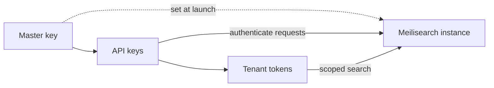

Meilisearch uses a key-based authentication system to protect your data. Understanding how keys work is the first step to securing your instance.

## How authentication works

Meilisearch's security model has three layers:

1. **Master key**: a secret you set at launch. It is never used directly in API requests, but generates the default API keys
2. **API keys**: credentials used to authenticate API requests. Meilisearch creates two default keys (admin and search) when you set a master key
3. **Tenant tokens**: short-lived, client-side tokens derived from API keys. They enforce per-user search rules without exposing your API keys

## Security checklist

For production self-hosted instances:

- [ ] Set a [master key](/resources/self_hosting/security/master_api_keys) of at least 16 bytes
- [ ] Set the [environment to `production`](/resources/self_hosting/configuration/reference#environment)
- [ ] Use HTTPS via a [reverse proxy](/resources/self_hosting/deployment/running_production) or [direct SSL](/resources/self_hosting/security/http2_ssl)
- [ ] Use the **search API key** (not the admin key) in front-end applications
- [ ] Consider [tenant tokens](/capabilities/platform/security/overview) for multi-tenant search
- [ ] Restrict network access with firewall rules

## Next steps

<CardGroup cols={2}>
  <Card title="Master key and API keys" icon="key" href="/resources/self_hosting/security/master_api_keys">
    Understand the difference between master key and API keys, and how to manage them.
  </Card>
  <Card title="Secure your project" icon="shield" href="/resources/self_hosting/security/basic_security">
    Step-by-step tutorial for setting up authentication on your instance.
  </Card>
  <Card title="Protected and unprotected instances" icon="lock-open" href="/resources/self_hosting/security/protected_unprotected">
    Learn what happens when your instance has no master key.
  </Card>
  <Card title="HTTP/2 and SSL" icon="lock" href="/resources/self_hosting/security/http2_ssl">
    Configure HTTPS directly on Meilisearch without a reverse proxy.
  </Card>
</CardGroup>
